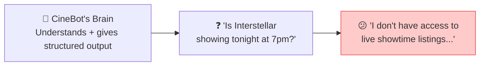
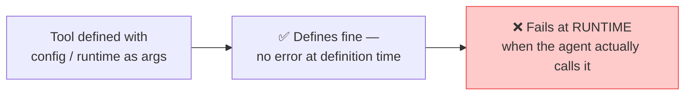
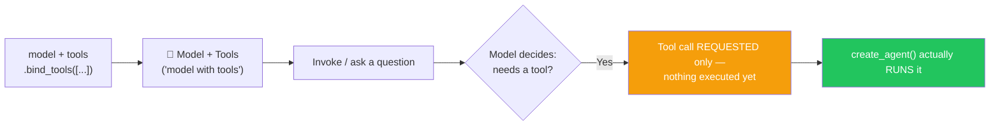
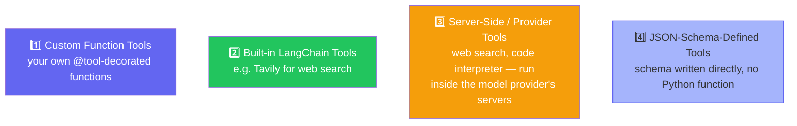
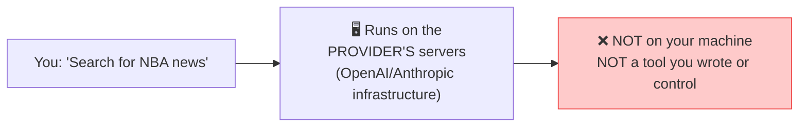
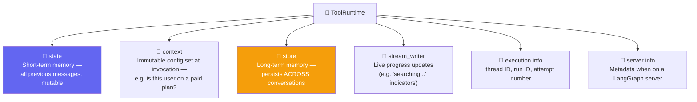
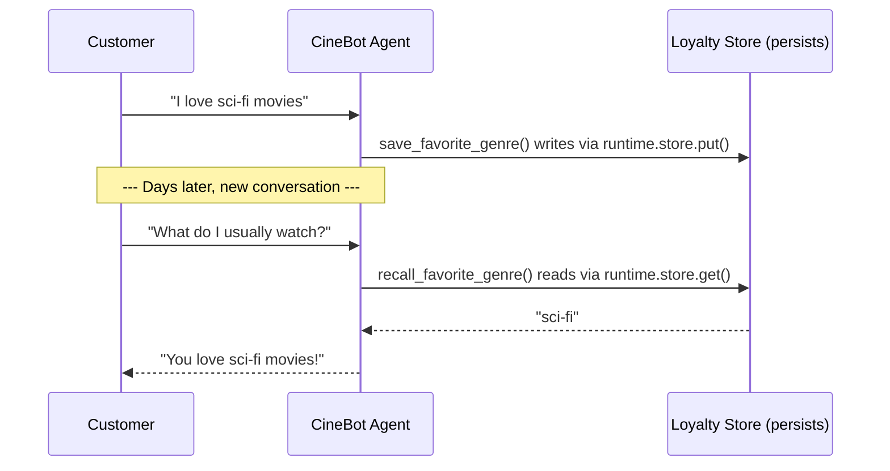

# 🛠️ Tools Deep Dive — Complete Guide with Analogies

**Author:** Pranay  
**Course:** Agentic AI Specialization  
**Session Duration:** ~5+ hours | **Date:** 26 July 2026

---

## 📋 Table of Contents
1. [A Brain Without Hands](#-a-brain-without-hands)
2. [Writing Your First Tool](#-writing-your-first-tool)
3. [Customizing a Tool's Name & Description](#-customizing-a-tools-name--description)
4. [Tools You Don't Have to Write Yourself](#-tools-you-dont-have-to-write-yourself)
5. [Argument Schemas — Why Field() Beats Plain Type Hints](#-argument-schemas--why-field-beats-plain-type-hints)
6. [Two Names You Can Never Use — config and runtime](#-two-names-you-can-never-use-config-and-runtime)
7. [Binding a Tool vs. Actually Running It](#-binding-a-tool-vs-actually-running-it)
8. [Four Kinds of Tools](#-four-kinds-of-tools)
9. [Tool Runtime — The Mirror Analogy](#-tool-runtime--the-mirror-analogy)
10. [Putting It to Work — A Tool With Memory](#-putting-it-to-work--a-tool-with-memory)
11. [Live Q&A Highlights](#-live-qa-highlights)
12. [Action Items](#-action-items)

---

## 🧠 A Brain Without Hands

**Analogy:** Think of a language model like a **brilliant strategist** who can plan complex operations but has no arms or legs. They can tell you exactly what needs to be done, but they can't actually do anything themselves. They can't open a door, make a phone call, or look something up. That's exactly what a model is — all brain, no hands.

Imagine you've built an AI movie-booking assistant — call it **CineBot**. It has a solid brain: it understands natural language, and thanks to structured output, it always replies in a clean, predictable format instead of free-flowing text.

Now ask it something simple: *"Is Interstellar showing tonight at 7pm?"*



CineBot honestly admits it has no idea — it has no access to live showtime data. And that's the real lesson here: **a model, no matter how smart, is still just a brain.** It can reason, format, and hold a conversation, but it cannot *act* in the world. It can't look anything up, book anything, or change anything outside of the conversation itself.

That's the gap **tools** exist to close.

---

## ✍️ Writing Your First Tool

**Analogy:** Think of a tool like **the assistant's hands** — the part of the brain that can actually reach out and touch the world. If the brain says "I need to know the weather," the hands go to a weather website and bring back the answer.

A tool, at its core, is nothing more than a regular Python function — wrapped so that an AI agent can discover it, understand what it does, and call it.

```python
from langchain_core.tools import tool

@tool
def check_showtimes(movie_title: str) -> str:
    """Get available showtimes for a given movie."""
    # ...implementation...
    return "Interstellar: 7:00 PM, 9:30 PM"
```

The `@tool` decorator does the wrapping. Two things about the function become especially important the moment you add it:

- The **function name** becomes the tool's name
- The **docstring** becomes the tool's description — and this is what actually gets sent to the AI, so it knows what the tool does and when to reach for it

**Key insight:** Tools are just glorified API calls, or functions. If you can't write a clean, well-structured Python function, you won't be able to write a good tool either — because that's genuinely all a tool is. There's no extra magic layered on top.

---

## 🎨 Customizing a Tool's Name & Description

Sometimes the function you're wrapping doesn't already have a great name for AI consumption — maybe it's called `reserve()` because that name made sense elsewhere in your codebase. `@tool` lets you override both the name and the description without touching the function itself:

```python
@tool("book_seats", description="Book or reserve a seat. Use whenever a customer wants to book.")
def reserve(movie: str, seats: int) -> str:
    """A short internal docstring."""
    return f"Reserved {seats} seat(s) for {movie}"
```

**Analogy:** Think of this like **renaming a file** — the file contents stay the same, but the new name makes it easier to find and understand.

By default, the function name becomes the tool name and the docstring becomes the description — but overriding both is common when you're reusing an existing function, or when someone else already wrote it and named it for a different purpose.

---

## 🔍 Tools You Don't Have to Write Yourself

Not every tool needs to be built from scratch. LangChain ships pre-built tools for common jobs — web search being the most obvious example, through a library called Tavily:

```python
from langchain_tavily import TavilySearch

search_tool = TavilySearch()  # a pre-built LangChain tool for web search
```

**Analogy:** Think of this like **buying a pre-built shelf** instead of cutting the wood and hammering it together yourself. It's ready to use immediately.

---

## 📐 Argument Schemas — Why Field() Beats Plain Type Hints

**Analogy:** Think of type hints like **menu prices** — they give you a general idea of what to expect. A Pydantic schema is like **a full nutritional breakdown** — it tells you everything about what you're ordering, including constraints, defaults, and descriptions.

A tool with plain type hints works, but it doesn't tell the model much. Compare a bare function signature against a proper Pydantic schema:

```python
from pydantic import BaseModel, Field
from typing import Literal

class SeatBookingInput(BaseModel):
    movie_title: str = Field(description="Exact movie title")
    seat_count: int = Field(gt=0, description="Number of seats")
    preferred_row: Literal["front", "middle", "back"] = Field(default="middle")

@tool(args_schema=SeatBookingInput)
def book_seats(movie_title: str, seat_count: int, preferred_row: str) -> str:
    """Book seats for a movie."""
    return f"Booked {seat_count} seat(s) for {movie_title} in the {preferred_row} row"
```

**The token trade-off:** A richer schema costs slightly more tokens — but the priority is getting the right answer, in as few total round-trips as possible. If skipping a detailed schema means the model sends malformed input and you have to catch the error and retry, you've spent far more tokens than the 20-30 extra tokens the schema would have cost upfront.

**Key insight:** Sending a little more information so the model gets it right the first time is almost always the better trade.

---

## 🚫 Two Names You Can Never Use — config and runtime

Here's a trap worth knowing about before you hit it yourself. Suppose you're building a tool for booking seats, and you want to pass along some configuration:

```python
@tool
def get_weather(location: str, config: str) -> str:
    """Get weather for a location."""
    ...
```

**Analogy:** Think of this like **using a reserved parking spot**. The spot looks empty, but it's actually reserved for the building's maintenance team. If you park there, you'll get towed — but only after you've parked. Same with `config` and `runtime` — they're reserved for LangChain's internal use.

This defines just fine. No error, nothing looks wrong. The trouble starts the moment an agent actually tries to *call* the tool — that's when it fails, with a runtime error.



**The reason:** `config` and `runtime` are reserved parameter names in LangChain. They're never available for you to use as ordinary tool arguments.

**The takeaway:** If you want to use configuration or runtime-style data inside a tool, just give it a different name.

---

## 🔗 Binding a Tool vs. Actually Running It

This next distinction is one of the most commonly misunderstood parts of working with tools.

**Analogy:** Think of binding a tool like **hiring a contractor** — you tell the contractor "I might need you to build a bookshelf." The contractor knows how to do it and could do it, but they don't start building until you actually give the order. Binding tools to a model is like telling the model "these people are available to help you" — but the model doesn't actually call them until you give the command.

Binding a tool to a model looks like this:

```python
tools = [check_showtimes, book_seats]
model_with_tools = model.bind_tools(tools)

response = model_with_tools.invoke("Is Interstellar showing tonight, can you book two seats?")
```

Here's the question to sit with: once a tool has been bound to a model, can the model ever call it on its own?

**No.** The AI can never call a tool itself — not now, not with any framework, not ever. A model with tools bound to it can only *decide* that a tool should be called and *describe* the call it wants — nothing more.

Run the code above and inspect the response, and this becomes concrete. The `content` field comes back **completely empty**. The actual instruction lives inside `response.tool_calls` instead — the tool's name (`book_seats`), its arguments (`movie_title: "Interstellar"`, `seat_count: 2`, `preferred_row: "middle"`).



A `model_with_tools` object can never make anything actually happen. It can request that `book_seats` be called with a certain set of arguments — that's all. To get from *request* to *result*, you need a complete harness wrapped around the model: something that reads the tool call, executes the real function, and feeds the result back in. That harness is exactly what `create_agent()` provides.

---

## 📚 Four Kinds of Tools

Tools aren't all built the same way. Broadly, they fall into four categories:



**Custom function tools** are what we've been building throughout — your own Python functions, wrapped with `@tool`.

**Built-in LangChain tools** are pre-packaged ones like Tavily, ready to use out of the box.

### Server-Side Tools: A Genuinely Different Category

**Analogy:** Think of server-side tools like **cloud applications** — they run on someone else's computers, not yours. When you use Gmail, the app runs on Google's servers, not your laptop. Server-side tools run on the model provider's infrastructure.

Here's a question worth pausing on: when ChatGPT or Claude performs a live web search right inside the chat interface, does that search run on *your* machine?



It doesn't. That search runs entirely on the model provider's own servers — it's a capability baked directly into how the model is served, not a tool a developer wrote, controls, or can inspect.

### JSON-Schema-Defined Tools

The fourth category skips Python functions entirely: a tool can be defined by writing its schema directly in JSON, in a standardized, provider-agnostic format. It's a valid approach and worth recognizing when you encounter it, but Pydantic remains the more practical, readable choice for day-to-day tool-building.

---

## 🪞 Tool Runtime — The Mirror Analogy

There's a useful analogy for understanding what a model can and can't see when it's deciding how to call a tool: **a model only ever sees its own reflection.**

**Analogy:** Imagine you're standing in front of a magic mirror. The mirror shows you exactly what you want to see — but you can never see what's behind the mirror. The model sees the tool's arguments like a reflection — it sees `location` but never sees `runtime`, which is behind the mirror.

Concretely: a model can only see the arguments a tool explicitly declares. If a tool's signature is `def get_weather(location: str)`, the model sees exactly one thing — `location`. Nothing more exists as far as the model is concerned. That's its reflection in the mirror.

But a tool itself can see a lot more than the model does, through a special parameter called `runtime`:

```python
from langchain.tools import ToolRuntime

@tool
def get_weather(location: str, runtime: ToolRuntime) -> str:
    """Get weather for a location."""
    # `location` — visible to the model, part of what it decides to send
    # `runtime`  — invisible to the model, full of backend-only context
    ...
```

Print this tool's `.args`, and `runtime` never shows up — only `location` does. That confirms the mirror analogy precisely: `runtime` is purely a backend mechanism, invisible to the model, but fully available to the tool's own code once it's actually called.

### What Actually Lives Inside `runtime`



- **`state`** is short-term memory — the previous messages and mutable data tied to the current conversation
- **`context`** is immutable configuration set when the agent is invoked — for example, whether a given user is on a paid plan
- **`store`** is long-term memory — data that survives *across* entirely separate conversations
- **`stream_writer`** enables live progress updates while a tool is still running
- **`execution info`** carries identifying and retry information for the current run
- **`server info`** carries server-specific metadata

---

## 🎬 Putting It to Work — A Tool With Memory

**Analogy:** Think of this like a **loyalty card program**. When you visit a coffee shop, they remember your favorite order. The next time you visit, they already know what you want. Tools with `runtime.store` work the same way — they remember things about you across conversations.

Once a tool has access to `runtime`, it stops being purely stateless. It can read and write data that persists — which means an agent can genuinely *remember* things about a customer across separate conversations, not just within a single chat's message history.

```python
from langgraph.store.memory import InMemoryStore
from langchain.tools import ToolRuntime, tool

loyalty_store = InMemoryStore()  # like a dictionary that survives across conversations

@tool
def save_favorite_genre(customer_id: str, genre: str, runtime: ToolRuntime) -> str:
    """Save a customer's favorite movie genre for future visits."""
    runtime.store.put(customer_id, "preferences", {"favorite_genre": genre})
    return f"Got it! I'll remember you like {genre} movies."

@tool
def recall_favorite_genre(customer_id: str, runtime: ToolRuntime) -> str:
    """Recall a customer's favorite genre if previously saved."""
    result = runtime.store.get(customer_id, "preferences")
    if result:
        return f"Your favorite genre is {result.value['favorite_genre']}"
    return "We don't have any saved preference for this customer."

agent = create_agent(
    model=model,
    tools=[save_favorite_genre, recall_favorite_genre],
    store=loyalty_store,   # attaches the store so tools can access it via runtime
)
```



**Key insight:** Tools are no longer purely stateless input-in, output-out functions. With `runtime.store`, a tool can read and write persistent data, which is what gives an agent genuine cross-session memory.

---

## 💬 Live Q&A Highlights

| Question | Answer |
|---|---|
| **OpenAI API says my requests are being stopped — do I need a credit card?** | Yes — OpenAI requires at least $5 of prepaid credit before the API works. Groq and OpenRouter remain better starting points for learning: free, rate-limited, no card required. |
| **How do I switch a working setup from one provider to another?** | Just swap the model string (e.g., `groq:llama-3.3-70b` instead of `openai:gpt-5-mini`) and make sure the matching API key is available — nothing else needs to change. |
| **My `.env` key isn't loading even with `load_dotenv()` — why?** | Almost always mundane: mismatched variable name, stray spaces, or the `.env` file not being read from the right working directory. |
| **Do `args_schema` field names need to match the function's parameter names?** | Yes, exactly. If the schema says `seat_count` but the function says `seats`, they won't be linked — no auto-mapping happens. |
| **Does Python enforce types on its own, without Pydantic?** | No. Plain Python doesn't check types at runtime — nothing stops a string being passed where an int was expected. Pydantic is what adds real enforcement. |
| **How is `args_schema` different from a hand-written JSON schema?** | Same goal, automated. `@tool(args_schema=YourModel)` extracts the same rich field-level detail and sends it to the model, without writing the schema by hand. |
| **Why is `config`/`runtime` a runtime error, not a compile-time one?** | Beyond framework-portability reasons, Python itself has no compile-time type checking (unlike Java). Tools like MyPy/Pyright add that, but require restructuring how the code is written. |
| **What does `return_direct` actually do?** | Sends a tool's raw output straight back to the user, skipping the model's final pass — used when a model rewording the output (e.g., a refund policy) could dangerously change its meaning. |
| **Can I use `return_direct` and still have the model double-check the output?** | No — the two goals conflict. Verifying the output means putting the model back in the loop, reintroducing the hallucination risk `return_direct` exists to avoid. |
| **Is `InMemoryStore` recoverable after a restart?** | No — it's RAM-based; everything is lost when the process stops. Production systems use a persistent store (e.g., Postgres) instead. |
| **Does store performance/scaling depend on LangChain?** | No — it's a database problem. Scaling characteristics belong to whatever storage technology sits underneath; LangChain just provides the read/write interface. |
| **How should growing conversation context be managed?** | No single correct technique — summarizing older messages, dropping old ones, or a mix, chosen empirically based on results. Goal: maximum performance from minimum context, since cost scales with tokens. |
| **Does chaining a structured-output call directly (vs. two separate steps) add latency?** | No meaningful difference — nothing is sent to the model until the final `.invoke()`, so combining steps is arguably cleaner with no real cost. |
| **How do I stay current in such a fast-moving field?** | Fundamentals first — strong basics make new tools fast to evaluate. Blogs/news help with awareness, but aren't a substitute for solid basics. |

---

## ✅ Action Items

- [ ] **Write a Tool:** Write a `@tool`-decorated function from scratch with a clear docstring, and confirm the model can see and use its description
- [ ] **Customize Names:** Practice overriding a tool's name and description explicitly rather than relying on defaults
- [ ] **Build Args Schema:** Build a Pydantic `args_schema` for a tool with `Field()` constraints, and compare `.args` output with and without it
- [ ] **Test Reserved Names:** Deliberately name a tool argument `config` or `runtime` and observe the runtime failure firsthand
- [ ] **Add Runtime:** Add a `runtime: ToolRuntime` parameter to a tool and print `.args` to confirm the model never sees it
- [ ] **Memory Demo:** Recreate the `save_favorite_genre` / `recall_favorite_genre` demo using `InMemoryStore` and `runtime.store`
- [ ] **Tool Types Review:** Revise all four tool types (custom function, built-in LangChain, server-side/provider, JSON-schema)
- [ ] **Preparation:** Come back ready for **Agents in depth** — the module that ties Models, Messages, Structured Output, and Tools together

---

## 📝 Key Takeaways

1. **Tools are the agent's hands** — they let the agent act on the world
2. **A tool is just a Python function** wrapped with `@tool`
3. **Arg schemas with Pydantic** dramatically improve reliability
4. **`config` and `runtime` are reserved** — never use them as tool arguments
5. **Binding a tool ≠ running it** — binding only makes it available; an agent actually runs it
6. **Four kinds of tools** — custom, built-in, server-side, and JSON-schema
7. **`runtime` is invisible to the model** — it's backend-only context
8. **`runtime.store` gives tools memory** — persistent across conversations
9. **Fundamentals first** — strong basics make new tools fast to evaluate

---

## 📚 Additional Resources

- [LangChain Tools Documentation](https://docs.langchain.com/oss/python/langchain/tools)
- [LangChain Tool Runtime](https://docs.langchain.com/oss/python/langchain/tool-runtime)
- [Pydantic Documentation](https://docs.pydantic.dev/)
- [Tavily Search](https://tavily.com/)

---
