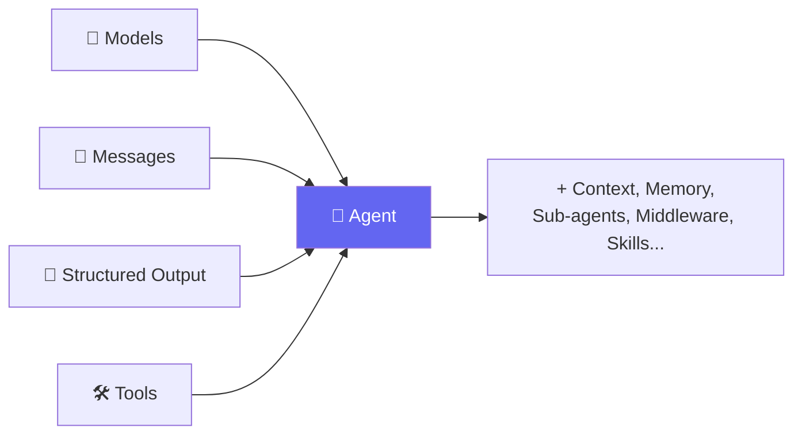
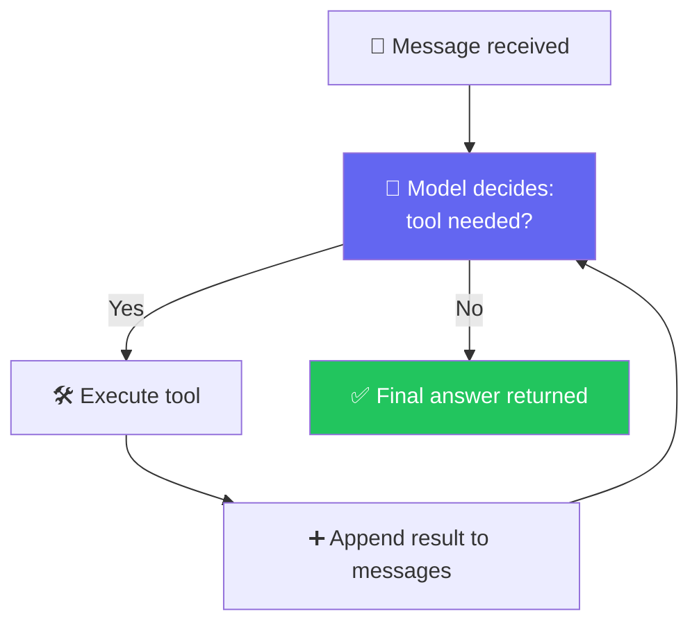
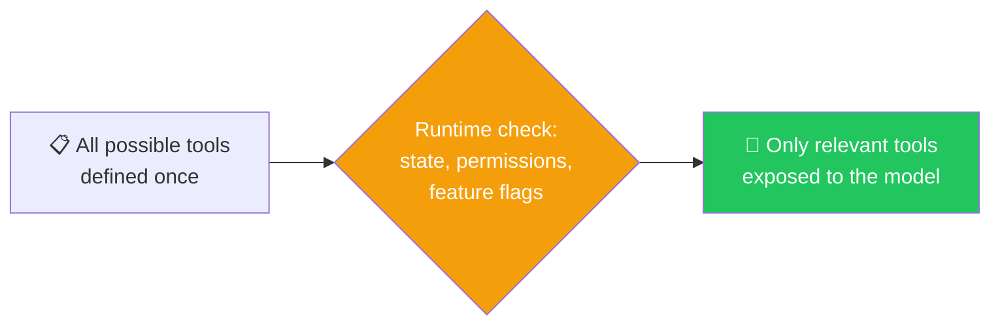
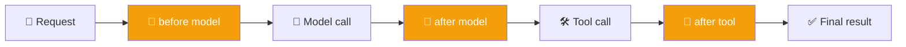
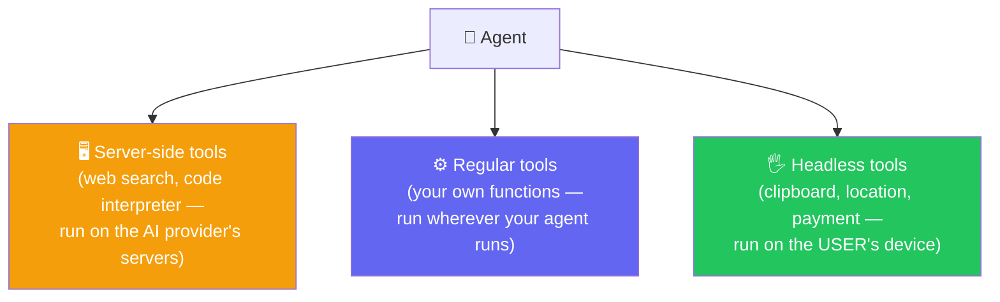

# 🤖 Agents, Middleware & Memory — Complete Guide with Analogies

**Author:** Pranay  
**Course:** Agentic AI Specialization  
**Date:** 1 August 2026

---

## 📋 Table of Contents
1. [What is an Agent?](#-what-is-an-agent)
2. [The Agentic Loop](#-the-agentic-loop)
3. [LangChain, LangGraph, LangSmith, Deep Agents](#-langchain-langgraph-langsmith-deep-agents)
4. [Tools — The Agent's Hands](#-tools--the-agents-hands)
   - [What is a Tool?](#what-is-a-tool)
   - [How Tools are Built](#how-tools-are-built)
   - [args_schema — Structured Tool Inputs](#args_schema--structured-tool-inputs)
   - [Reserved Tool Parameters](#reserved-tool-parameters)
   - [ToolRuntime and Hidden Context](#toolruntime-and-hidden-context)
   - [Memory with runtime.store](#memory-with-runtimestore)
   - [return_direct=True](#return_directtrue)
5. [Dynamic Tool Loading](#-dynamic-tool-loading)
6. [Middleware — Cutting Into the Loop](#-middleware--cutting-into-the-loop)
7. [Headless Tools](#-headless-tools)
8. [Real Tools — The TripMate Project](#-real-tools--the-tripmate-project)
9. [Memory Management](#-memory-management)
   - [The Forgetting Problem](#the-forgetting-problem)
   - [Checkpointing](#checkpointing)
   - [Memory Saver vs. Memory Store vs. Caching vs. Database](#memory-saver-vs-memory-store-vs-caching-vs-database)
10. [Live Q&A Highlights](#-live-qa-highlights)
11. [Action Items](#-action-items)

---

## 🧠 What is an Agent?

**Analogy:** Think of an agent like a **skilled personal assistant**. You give them a task, they think about what needs to be done, use various tools (phone, computer, calendar), and keep working until the task is complete. They don't just answer questions — they take action.

An agent is not just a chatbot. It is a system where a language model can:
- Understand the user
- Decide what to do
- Use tools if needed
- Keep going until the task is complete

**Simple formula:**
```
Model + Tools + Loop = Agent
```

**The key difference:**
- A normal model answers questions
- An agent can **act**

### The Harness

> *"An agent is a model plus a harness. Around the model, you can add tools, context, sub-agents, memory, skills, middleware — anything that helps you take the best advantage of the model."*



**What has changed over the last 4-5 years?** Logically, nothing else has changed. We have just bought an artificial brain. Apart from the LLM, everything else is exactly the same. Our whole idea becomes: **how can we best harness this model?**

---

## 🔁 The Agentic Loop

**Analogy:** Think of this like a **restaurant order process**. You place an order → the chef checks if they have ingredients (tools) → if not, they check the inventory → then they prepare the food → finally, they serve it to you. Each step builds on the previous one.

The agent loop works like this:
1. The user gives a request
2. The model thinks about what is needed
3. It may call a tool
4. It gets more information
5. It produces the final answer



**Key insight:** This used to be called the **ReAct pattern**, but "Agentic Loop" is the more accurate term today.

**Important detail:** A tool's result **always goes back to the model, never straight to the user** — the user only ever sees the model's final response after it has processed that result.

---

## 📚 LangChain, LangGraph, LangSmith, Deep Agents

| Framework | Purpose | Analogy |
|---|---|---|
| **LangChain** | Main framework for building LLM-based applications and agents | Like the **blueprint** for your AI house — provides the structure |
| **LangGraph** | Stateful workflows and multi-step agent behavior | Like the **electrical wiring** — manages the flow and state |
| **LangSmith** | Debugging, tracing, and monitoring | Like **security cameras** — lets you watch what's happening |
| **Deep Agents** | Advanced autonomous, layered reasoning | Like **AI with executive function** — can plan and delegate |

**Note:** Interview questions for this class intentionally reflect LangChain's latest version (v1.0+), not the older "Classic" version — the course stays on the newer version since that's the direction the field is moving.

---

## 🛠️ Tools — The Agent's Hands

### What is a Tool?

**Analogy:** Think of tools like the **assistant's skill set**. A real assistant knows how to make phone calls, send emails, book flights, and search for information. Each skill is like a tool the assistant can use to get things done.

A tool is a function that the model can call to do something real. Examples:
- Check showtimes
- Book seats
- Search the web
- Access a database
- Read memory

### How Tools are Built

**Analogy:** Think of a tool like a **job posting**. The docstring is the job description that tells the model what this tool does, when to use it, and what it expects. A vague job description attracts the wrong applicants — a vague tool description makes the model use it incorrectly.

```python
from langchain_core.tools import tool

@tool
def check_showtimes(movie_title: str) -> str:
    """Check available showtimes for a movie."""
    return "7:00 PM and 10:15 PM"
```

**Important rules:**
- `bind_tools()` makes tools visible to the model
- It does NOT run them by itself
- The actual execution happens inside the agent loop

**Why the docstring matters:** The docstring acts like the tool's pitch to the model. If the description is weak, the model may not know when to use the tool.

### args_schema — Structured Tool Inputs

Sometimes a tool needs more complex input. Instead of relying only on simple type hints, we can define a Pydantic schema.

```python
from pydantic import BaseModel, Field
from typing import Literal

class OrderInput(BaseModel):
    dish_name: str = Field(description="Name of the dish to order")
    quantity: int = Field(ge=1, le=10, description="Number of portions")
    delivery_or_pickup: Literal["delivery", "pickup"] = Field(description="Delivery method")

@tool(args_schema=OrderInput)
def place_order(dish_name: str, quantity: int, delivery_or_pickup: str) -> str:
    """Place a food order."""
    return f"Ordered {quantity}x {dish_name} for {delivery_or_pickup}"
```

**Why this matters:**
- Gives the model richer guidance
- Provides better validation
- Makes the tool's interface clearer

### Reserved Tool Parameters

Two names are special and should NOT be used as tool parameters:
- `config`
- `runtime`

**Analogy:** Think of these like **reserved parking spots**. You can't park there because they're for the building's maintenance team. LangChain reserves these parameters for its internal use.

### ToolRuntime and Hidden Context

`ToolRuntime` allows a tool to access information that the model does NOT directly see.

```python
from langchain_core.tools import tool

@tool
def get_user_preferences(runtime: ToolRuntime) -> str:
    """Get the user's saved preferences."""
    preferences = runtime.store.get("user_preferences", {})
    return f"User preferences: {preferences}"
```

**The model sees:** Only the declared tool inputs
**The model does NOT see:** Hidden runtime information like:
- `runtime.state` — current conversation state
- `runtime.context` — per-run context
- `runtime.store` — persistent memory

**Analogy:** Think of this like a **secret service agent**. The model (the public) only sees what the tool (the agent) reveals. But the tool has access to classified information (runtime) that the model never sees.

### Memory with runtime.store

A tool can save long-term information in `runtime.store`.

**Use cases:**
- Remember a customer's favorite genre
- Remember dietary preferences
- Remember trip preferences across sessions

**Key distinction:**
- `state` is for **this conversation** (short-term)
- `store` is for **longer-term memory** (across conversations)

### return_direct=True

Sometimes the tool's output should be returned verbatim, without the model rephrasing it.

```python
@tool(return_direct=True)
def get_exact_refund_policy() -> str:
    return "Tickets are refundable up to 2 hours before showtime."
```

**When to use:** When exact wording matters — policies, rules, legal statements.

**Analogy:** Think of this like a **company policy document**. You don't want the assistant to rephrase it — you want the exact wording, word for word.

---

## 🎛️ Dynamic Tool Loading

**Analogy:** Think of a **menu that reprints itself before you sit down**. A VIP member sees the full menu; a regular guest sees a shorter menu — not because they were told "don't order the VIP item," but because those items simply aren't printed on their menu at all.

> *"With dynamic tool loading, the set of tools available to the agent is modified at runtime, rather than defined all upfront."*



### Two Approaches:

1. **Filtering pre-registered tools** — register every possible tool at agent-creation time, then dynamically filter based on state, permissions, and context
2. **Registering tools dynamically** — for cases where the full toolset isn't known upfront (e.g., tools arriving via MCP)

### The Real Problem: Not Every Tool Belongs to Every User

**Scenario:** A booking agent has a standard tool, a VIP lounge tool, and an admin tool. A regular, non-paying user asks for a VIP seat.

**Two tempting (but wrong) fixes:**
1. Ask the user if they're a VIP — pointless, since a user will always say "yes"
2. Permanently remove the VIP tool — breaks things for actual VIP users

**The correct approach:** Dynamic tool loading based on user status.

### Real Proof: ChatGPT's Own Connectors

Each connector (Gmail, Slack, etc.) is a collection of tools. On a free-tier account, ChatGPT still loads/pays the token cost for tools a user can never use — a real, ongoing cost companies lose money on.

---

## 🧵 Middleware — Cutting Into the Loop

**Analogy:** Think of middleware like **airport security**. You go through multiple checkpoints — baggage screening, passport control, security scan. Each checkpoint can check, modify, or stop your journey. Middleware does the same for your agent's journey.

> *"What if you cut a few things in the middle here? Before calling the model, I do something. After calling the model, I do something. Before calling the tool, after calling the tool, after observing — you're going in the middle."*



### Live Code: State-Based Filtering

```python
def only_public_tools_if_unauthenticated(request):
    if not request.state.get("authenticated"):
        request.tools = [t for t in request.tools if t.name.startswith("public_")]
    return request
```

**Analogy:** This is like a **nightclub bouncer** — if you don't have a ticket (authentication), you only get access to the public areas (public tools).

### The VIP Booking Demo — Including a Live Bug

```python
def vip_gate_middleware(request):
    is_vip = request.state.get("is_vip_member", False)
    if not is_vip:
        request.tools = [t for t in request.tools if t.name != "vip_lounge_booking"]
    return request
```

**The Bug:** Passing `is_vip_member=True` directly into `invoke()` didn't work — the middleware kept reading it as `False`.

**The Fix:** Define a custom state schema that explicitly tells the agent to track `is_vip_member` alongside its built-in fields.

> *"Can I say that, based on the user, at runtime — not in the starting, at the runtime part — I'll be able to change which tool my agent will have and which it will not?"*

---

## 🖐️ Headless Tools

**Analogy:** Think of headless tools like **apps on your phone that need permission**. When an app wants your location, a pop-up appears asking for permission. The app doesn't get your location until you approve it. Headless tools work the same way.

> *"If you have to get the payment done — does that happen at your end, or at the user's machine? If you have to access the clipboard of the user, does that happen at your machine or the user's machine?"*



**How headless tools work:**
- Tool definitions (name, description, argument schema) are registered on the server
- The IMPLEMENTATION is registered only on the client
- Executed after a short interrupt-or-resume handshake

**Real-world example:** If Amazon needs your location, it runs in your browser, gets the location, and sends it back to Amazon — Amazon's US server has no way to get it directly.

---

## 🧳 Real Tools — The TripMate Project

> *"We were just dumbing up the weather till now. Let's now learn these things by creating real tools rather than mocking them."*

TripMate is a travel-planning agent built with REAL tools instead of mocked/hard-coded ones.

### Real Weather Tool
Built using **Open-Meteo** — a free, keyless, open-source weather API.

### Real Search Tool
Uses **Tavily** for genuine travel research.

> *"Tavily is third-party. Is it a LangChain method? No — LangChain is just giving me an easier way to integrate it."*

### Real Persistent Database
Using SQLite to store trips persistently.

> *"If my application restarts, will this get disconnected? No — because I'm storing it outside, in a SQL DB. It will remain."*

**Result:** Four real tools — save trip, get saved trip, web search, real weather — giving TripMate a genuinely working toolset, not placeholders.

---

## 🗄️ Memory Management

### The Forgetting Problem

**Analogy:** Think of this like **talking to someone with amnesia**. You introduce yourself, and five minutes later they ask who you are again. That's your agent without memory.

Demo: Tell CineBot "my name is Pranay," then in the NEXT message ask "who am I?" — the agent does NOT remember, by default.

> *"Your agent is not remembering you. I hope you see the problem, everyone."*

### Checkpointing

The fix:

```python
from langgraph.checkpoint.memory import InMemorySaver

checkpointer = InMemorySaver()

agent_with_memory = create_agent(
    model=model,
    tools=[...],
    checkpointer=checkpointer,
)

config = {"configurable": {"thread_id": "my-session-1"}}
agent_with_memory.invoke({"messages": [...]}, config=config)
```

> *"This is the official way. It's not that I've defined some custom checkpointing approach — this is how your agent remembers you, straight from the documentation."*

**thread_id explained:**
- Just a unique ID so the checkpointer can locate a particular chat
- The USER does NOT enter this — the application controls it
- New session → new/different thread_id

### Memory Saver vs. Memory Store vs. Caching vs. Database

| Concept | What it's for | Typical lifetime | Analogy |
|---|---|---|---|
| **Memory saver** (checkpointer) | Saving ONE conversation's history, tied to a thread_id | As long as that thread needs | A **notepad for this conversation** |
| **Memory store** | Saving information ABOUT A USER — preferences, facts — usable across conversations | Persistent by design | A **permanent file on the user** |
| **Caching** | Avoiding repeated expensive calls for near-identical requests | Short and tunable | A **sticky note on the fridge** |
| **Database** | General persistent storage for anything the app needs to keep | Persistent, application-defined | A **filing cabinet** |

> *"If a user says, 'I like Python as a language,' storing that just in a memory saver won't help — it's better in the memory store, because then it's usable across different chats too. That's what we call long-term memory."*

**Decision rule of thumb:**
- Short-lived conversational context → **Memory saver**
- Cross-session preferences → **Memory store**
- Repeated identical expensive calls → **Caching**
- Everything else persistent → **Database**

---

## 💬 Live Q&A Highlights

| Question | Answer |
|---|---|
| **Why can't a plain Python `if`/`else` decide which tools to send instead of middleware?** | Plain code outside the agent can't read the agent's own live state — that visibility only exists inside the agent's execution, which is exactly what middleware provides. |
| **Is `thread_id` a reserved keyword?** | No — it's just the identifier the checkpointer looks for in the config. The application controls how IDs are generated and assigned. |
| **Can I inspect what's actually stored in memory for a thread?** | Yes, via the checkpointer's API — but the full mechanics of state-as-checkpoints belong to LangGraph, covered there in depth. |
| **Does `InMemorySaver` have a time limit?** | No — it lasts exactly as long as the Python process runs. A persistent store (e.g., Postgres) removes that limit entirely. |
| **What happens if a tool fails or times out?** | Recoverable failures are typically retried as part of the harness; a fatal error causes the agent to fail outright. |
| **Can an agent discover brand-new tools at runtime?** | Yes — this is where MCP and middleware intersect; tools arriving dynamically can still be registered and made available mid-run. |
| **Does running a tool cost money the same way a model call does?** | No — only model calls consume tokens and cost money. A tool running on its own doesn't. |
| **Will this course cover training a model from scratch?** | No — the focus is entirely on using and harnessing existing models, not training them. |
| **How do I decide between memory store, memory saver, caching, and a database?** | No universal answer — short-lived conversational context → memory saver; cross-session preferences → memory store; repeated identical expensive calls → caching; everything else persistent → a database. |

---

## ✅ Action Items

- [ ] **Middleware Bug:** Recreate the VIP booking middleware example, and deliberately trigger the "state field not tracked" bug before fixing it with a custom state schema
- [ ] **Write Middleware:** Write a piece of middleware from scratch that filters tools based on `request.state`
- [ ] **Real Tool:** Build one genuinely real tool (a free public API, no key required) instead of a hard-coded placeholder
- [ ] **Memory:** Set up `InMemorySaver` with a `thread_id`, confirm an agent remembers a name across two `invoke()` calls, then swap the `thread_id` and confirm it forgets again
- [ ] **TripMate:** Walk through the TripMate build yourself: real weather, real search, real SQLite persistence
- [ ] **Memory Concepts:** Revise memory saver vs. memory store vs. caching vs. database until the distinctions are automatic
- [ ] **Preparation:** Come back ready for deeper **state, checkpointing, and LangGraph** coverage in upcoming classes

---

## 📝 Key Takeaways

1. **Agent = Model + Harness** — everything we add around the model makes it more capable
2. **Tools are the agent's hands** — they let the agent act on the world
3. **Dynamic tool loading** — gives the right tools to the right users at runtime
4. **Middleware** — lets you intercept and control the agent loop at every point
5. **Headless tools** — run on the user's device, not the server
6. **Memory** — comes in different forms for different needs (saver, store, cache, database)
7. **Checkpointing** — is how agents remember conversations across turns

---

## 📚 Additional Resources

- [LangChain Tools Documentation](https://docs.langchain.com/oss/python/langchain/tools)
- [LangGraph Checkpointing](https://langchain-ai.github.io/langgraph/concepts/persistence/)
- [LangChain Middleware](https://docs.langchain.com/oss/python/langchain/middleware)
- [Open-Meteo Weather API](https://open-meteo.com/)

---

