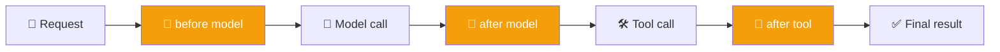

# 🧵 LangChain Middleware — Complete Guide with Analogies

**Author:** pranay  
**Course:** Agentic AI Specialization  
**Date:** 8 August 2026

---

## 📋 Table of Contents
1. [Why Middleware Exists](#-why-middleware-exists)
2. [Built-in Middleware Reference](#-built-in-middleware-reference)
   - [Summarization](#1-summarization-middleware)
   - [Human-in-the-Loop (HITL)](#2-human-in-the-loop-hitl-middleware)
   - [Model Call Limit](#3-model-call-limit-middleware)
   - [Tool Call Limit](#4-tool-call-limit-middleware)
   - [Model Fallback](#5-model-fallback-middleware)
   - [PII Detection](#6-pii-personally-identifiable-information-middleware)
3. [Multiple Middlewares Together](#-multiple-middlewares-together)
4. [LangChain vs. LangGraph](#-langchain-vs-langgraph)
5. [Guardrail vs. Middleware](#-guardrail-vs-middleware)
6. [Live Q&A Highlights](#-live-qa-highlights)
7. [Action Items](#-action-items)

---

## 🎯 Why Middleware Exists

**Analogy:** Think of middleware as the **security checkpoint at an airport**. Before you board the plane (the agent does something), your luggage is screened, your ID is checked, and certain actions are approved or blocked. Just like an airport has multiple checkpoints (baggage screening, passport control, security scan), middleware gives you multiple places to intercept and control an agent's behavior.

Middleware exists to give developers tighter control over what happens inside an agent. Without middleware, nothing stops an agent from replying rudely if asked to, and nothing automatically flags personal information handed to it. The agent already has everything it needs in terms of model, tools, prompts, and messages — but developers still need a way to intervene in what happens *between* those components.

**Six hook points around the agent loop:**
1. Before the agent runs
2. After the agent runs
3. Before the model is called
4. After the model is called
5. Before a tool is called
6. After a tool is called



This same idea shows up under different names elsewhere — Google's Agent Development Kit calls the equivalent concept a "callback" — but the underlying pattern is universal across serious agent frameworks, not a LangChain-specific quirk.

---

## 🛠️ Built-in Middleware Reference

### 1. Summarization Middleware

**Purpose:** Compress conversation history to manage token usage/cost as a conversation grows.

**Analogy:** Think of this like **taking meeting notes**. After a 2-hour meeting, you don't need every word — you need a summary. Similarly, as a conversation gets long, older messages get condensed into a summary to save tokens and keep the agent focused on recent context.

```python
from langchain.agents import create_agent
from langchain.agents.middleware import SummarizationMiddleware

agent = create_agent(
    model=model,
    tools=[...],
    middleware=[
        SummarizationMiddleware(
            model="anthropic:claude-haiku",   # A separate, often cheaper model
            trigger=("tokens", 4000),          # Triggers at 4000 tokens
            keep=("messages", 10),             # Keep last 10 messages untouched
        )
    ],
)
```

**Configuration options:**
- **`model`** — Summarizing text is itself a task that needs a brain. It doesn't have to be the same model powering the main agent; a cheaper model works fine purely for condensing.
- **`trigger`** — When summarization kicks in: an absolute token count, a message count, or a fraction of the model's total context length.
- **`keep`** — How much of the recent conversation to leave untouched after summarizing: a fraction, a token count, or a message count.

**Real-world connection:** The familiar "conversation has been compacted" behavior seen in long Claude chats is this exact mechanism running in the background.

**Trade-off:** Compressing a long history into a short summary can genuinely lose information — that's why models sometimes seem to "forget" things as a conversation grows long. If certain information absolutely must be retained, save it separately into long-term memory rather than relying on the summary alone.

---

### 2. Human-in-the-Loop (HITL) Middleware

**Purpose:** Pause agent execution so a human can approve, edit, reject, or respond to a proposed tool call before it runs.

**Analogy:** Imagine you're a **manager reviewing an important email** your assistant drafted. Before sending it, you review it, make edits, approve it, or reject it. HITL middleware gives you that same review power over your agent's actions.

**Why it only applies to tool calls:** Everything before a tool call is just the model reasoning; the tool call is the "hands" — the moment the agent actually changes something in the real world. That's the point worth pausing on.

```python
from langchain.agents.middleware import HumanInTheLoopMiddleware
from langgraph.checkpoint.memory import InMemorySaver
from langgraph.types import Command

agent = create_agent(
    model=model,
    tools=[read_email, send_email],
    checkpointer=InMemorySaver(),  # REQUIRED for HITL
    middleware=[
        HumanInTheLoopMiddleware(
            interrupt_on={
                "send_email": {"allowed_decisions": ["approve", "edit", "reject"]},
                "read_email": False,  # no interrupt needed
            }
        )
    ],
)

config = {"configurable": {"thread_id": "hitl-demo"}}
agent.invoke({"messages": [{"role": "user", "content": "Send an email to my manager saying I won't be in tomorrow."}]}, config=config)

# Resume later with a decision:
result = agent.invoke(Command(resume={"decisions": [{"type": "approve"}]}), config=config)
```

**Decision types:**
- `approve` — Run the tool as proposed
- `edit` — Change the arguments before running
- `reject` — Skip the tool call and return feedback
- `respond` — Return a human message directly for ask-user style tools

**Important distinction:** A support chatbot escalating to a human agent is **not** HITL — that's a *transfer*, where the agent hands off the entire conversation and steps out. True HITL keeps the agent in the loop, just paused for a decision.

---

### 3. Model Call Limit Middleware

**Purpose:** Cap total model calls to control cost and prevent infinite loops.

**Analogy:** Think of this like a **data plan on your phone**. You have a limited number of API calls you can make before you exceed your budget. This middleware is like setting a monthly data cap to prevent surprise bills.

```python
from langchain.agents.middleware import ModelCallLimitMiddleware

agent = create_agent(
    model=model,
    tools=your_tools,
    checkpointer=InMemorySaver(),   # required for thread_limit
    middleware=[
        ModelCallLimitMiddleware(
            thread_limit=5,        # max calls across the whole conversation
            run_limit=2,           # max calls per single .invoke()
            exit_behavior="end",   # graceful stop (or "exception")
        ),
    ],
)
```

---

### 4. Tool Call Limit Middleware

**Purpose:** Cap tool execution, especially irreversible operations.

**Analogy:** Imagine you're at an **all-you-can-eat buffet**. The run limit is like "you can only take 2 plates per trip to the buffet," while the thread limit is "you can only eat 10 plates total for the entire meal." This prevents a single user from getting too many tool calls.

```python
from langchain.agents.middleware import ToolCallLimitMiddleware

agent = create_agent(
    model=model,
    tools=your_tools,
    checkpointer=InMemorySaver(),
    middleware=[
        ToolCallLimitMiddleware(run_limit=8),               # global cap per invoke()
        ToolCallLimitMiddleware(
            tool_name="cancel_booking",
            thread_limit=2,   # per-tool cap across the whole conversation
            run_limit=1,      # per-tool cap per invoke()
        ),
    ],
)
```

**Setting the right limit:** This comes from domain knowledge, not a framework default — a web-search agent probably doesn't need more than 5–15 searches for most tasks. The developer who understands the business use case should be the one setting that number, rather than leaving it unbounded or guessing arbitrarily high.

---

### 5. Model Fallback Middleware

**Purpose:** Graceful degradation if the primary model provider fails.

**Analogy:** Think of this like having a **backup generator for your house**. When the main power fails, the backup kicks in automatically — your lights stay on, and you don't even notice the switch. This middleware is your AI's backup generator.

```python
from langchain.agents.middleware import ModelFallbackMiddleware

agent = create_agent(
    model=model,
    middleware=[
        ModelFallbackMiddleware(
            model="openai:gpt-5.4-mini",  # falls back here if the primary model fails
        )
    ],
)
```

**When this activates:** 404 errors, expired keys, any hard error from the primary provider.

**What it is NOT:** It isn't routing based on speed or cost, and it isn't a smart dispatcher choosing the "best" model for a task. It only activates when the primary model genuinely fails.

---

### 6. PII (Personally Identifiable Information) Middleware

**Purpose:** Detect and handle sensitive data before/after it reaches the model — a compliance requirement in healthcare, finance, etc.

**Analogy:** Think of this like a **redaction pen you'd use on legal documents**. Before sharing a document, you black out sensitive information like social security numbers or addresses. This middleware does the same thing automatically for your AI conversations.

**Examples of PII:**
- Email addresses
- Phone numbers
- Dates of birth
- Government IDs
- Passwords
- Credit card numbers

```python
from langchain.agents.middleware import PIIMiddleware

agent = create_agent(
    model=model,
    middleware=[
        PIIMiddleware("email", strategy="redact", apply_to_input=True),
        PIIMiddleware("credit_card", strategy="mask", apply_to_input=True),
    ],
)
```

**Two common strategies:**
- **Redact** — Remove the sensitive value entirely before it ever reaches the model
- **Mask** — Replace part of the value (e.g., showing only the last few digits) so the model can tell something is present without seeing the real value

**Custom PII detectors:**

Since ID formats like Aadhaar or PAN numbers are country-specific, LangChain supports defining custom PII detectors:

```python
import re
from langchain.agents.middleware import PIIMiddleware

aadhaar_pattern = re.compile(r"\b\d{12}\b")

agent = create_agent(
    model=model,
    middleware=[
        PIIMiddleware("aadhaar", detector=aadhaar_pattern, strategy="mask"),
    ],
)
```

---

## 🧩 Multiple Middlewares Together

**Analogy:** Like **layers in a cake**. Each layer adds something different, and the order matters — you don't put the frosting before the cake layers. Similarly, PII redaction should run before the model call, not after.

It is normal to attach several middlewares to one agent at the same time. For example, an agent can have:
- Summarization for context compression
- HITL for approval
- A tool limit for safety
- PII detection for privacy

The middlewares generally work well together, and their order is either defined or follows declaration order.

---

## 🗺️ LangChain vs. LangGraph

**Analogy:** Think of LangChain as a **high-level self-driving car interface** — you say "drive to the grocery store" and it handles the details. LangGraph is like **having direct controls over the steering, brakes, and engine** — you can build a more precise, deterministic route.

**When to use which:**

| Use LangChain + Middleware | Use LangGraph |
|---|---|
| Most straightforward agents | When precise state control is needed |
| Basic RAG systems | When deterministic execution is required |
| Small tool-using systems | When deep checkpointing control is needed |
| Most production use cases | When complex interrupts are required |

**Key insight:** LangChain sits on top of LangGraph, offering a more convenient, somewhat abstracted interface to the same underlying machinery. For most simple agents, and even for something like an enterprise RAG chatbot handling a handful of question types, LangChain with its built-in middleware is generally sufficient.

---

## 🔑 Guardrail vs. Middleware

**Analogy:** Think of guardrails as the *goal* (keeping the car on the road) and middleware as the *mechanism* (the actual metal barrier installed on the road). They aren't competing systems — guardrails need to be implemented *as* middleware.

| Concept | Definition |
|---|---|
| **Guardrail** | The goal — protecting the agent from doing something undesirable |
| **Middleware** | The mechanism — a specific way to achieve that goal |

**Example:** PII protection is a guardrail concept implemented through PII middleware.

---

## 💬 Live Q&A Highlights

| Question | Answer |
|---|---|
| **Why can't I just tell my AI "don't call the tool more than twice" instead of using a limit middleware?** | That instruction isn't reliable — a model can ignore it, and it breaks entirely if the model is swapped. Controlling it via code is specific and dependable in a way a prompt instruction never is. |
| **Will middleware add latency?** | Depends on the type — if it calls a model (like summarization does), yes, some. If it's pure code logic (like a call limit check), the overhead is minimal. |
| **Can I configure multiple HITL approval levels (e.g., two levels of sign-off)?** | Not out of the box — that requires writing a custom middleware. |
| **Does middleware that calls a model (e.g., for summarization) share the agent's main context?** | No — it runs against its own separate text rather than the agent's main running context. |
| **Is PII handled by guardrails or by middleware?** | Guardrail is the concept (protecting the agent); middleware is the mechanism used to implement that concept — not two competing systems. |
| **Can multiple middlewares be attached to one agent?** | Yes, without issue — they're simply passed in as a list. |
| **Do middlewares run in a random order when there are several?** | No — either a defined priority applies, or they follow the order they're declared in. They're designed not to collide. |
| **When should I use LangChain + middleware vs. dropping down to LangGraph?** | LangChain + middleware is enough for most agents, including simple RAG use cases. LangGraph is worth it when precise, deterministic control over state, checkpointing internals, or interrupts is genuinely needed. |

---

## ✅ Action Items

- [ ] **Summarization:** Recreate the `SummarizationMiddleware` example with your own `trigger` and `keep` values; watch it fire on a long conversation
- [ ] **HITL:** Build the `HumanInTheLoopMiddleware` send-email demo yourself; manually resolve the interrupt both via `Command(resume=...)` and your own approve/reject logic
- [ ] **Limits:** Add a model call limit and a tool call limit to an existing agent; deliberately trigger both
- [ ] **Fallback:** Set up `ModelFallbackMiddleware` and simulate a primary-model failure (e.g., an intentionally wrong API key) to confirm the fallback fires
- [ ] **PII:** Write one custom PII detector (using `re`) for an ID format relevant to your own country or use case
- [ ] **Concept Review:** Be ready to explain, in your own words, the difference between a guardrail and middleware — this is a common interview-style question
- [ ] **Preparation:** Come back ready for **custom middleware** — building your own from scratch rather than using LangChain's built-ins

---

## 📝 Key Takeaways

1. **Middleware turns a basic model into a more controlled, safer, and more reliable agent**
2. **Guardrail = concept, Middleware = mechanism** — remember this distinction
3. **Multiple middlewares can stack** like layers in a cake
4. **Checkpointer required** for HITL and persistent limits
5. **Order matters** — PII redaction before model call, etc.
6. **LangChain + middleware** is enough for most use cases
7. **LangGraph** when you need precise, deterministic control

---

## 📚 Additional Resources

- [Middleware Documentation](https://docs.langchain.com/oss/python/langchain/middleware)
- [Middleware API Reference](https://reference.langchain.com/python/langchain/middleware/)
- [Human-in-the-Loop Guide](https://docs.langchain.com/oss/python/langchain/human-in-the-loop)
- [Testing Agents](https://docs.langchain.com/oss/python/langchain/test/)

---

