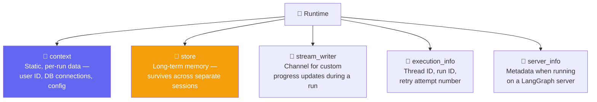
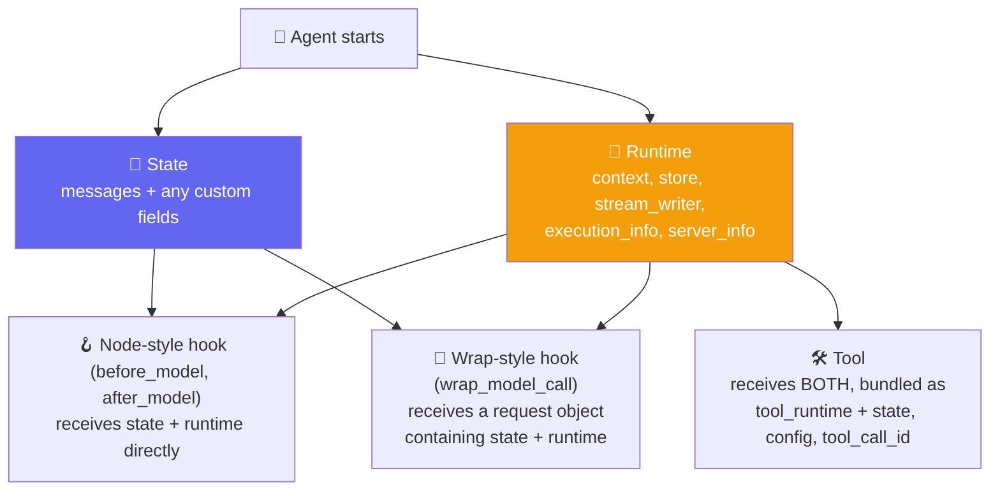
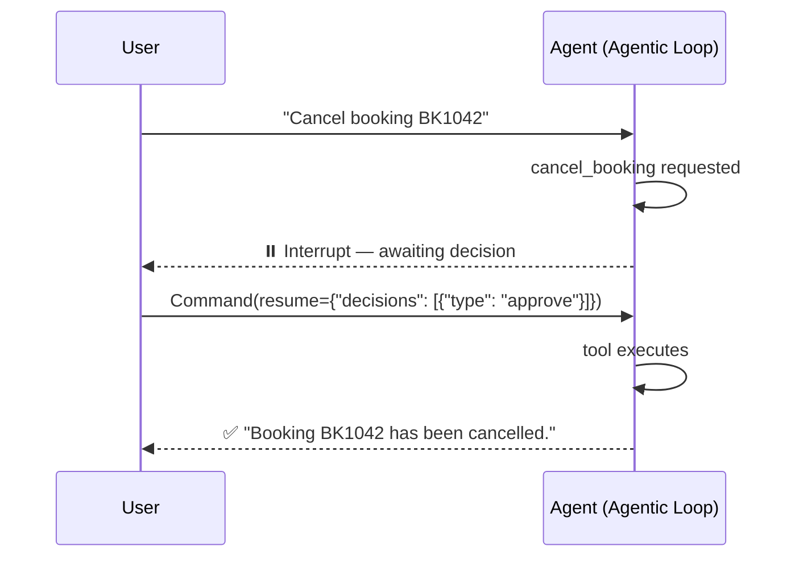

# 🧠 Runtime Deep Dive & Human-in-the-Loop — Complete Guide with Analogies

**Author:** pranay  
**Course:** Agentic AI Specialization  
**Date:** 22 August 2026

---

## 📋 Table of Contents
1. [The Problem Runtime Solves](#-the-problem-runtime-solves)
2. [The Five Components of Runtime](#-the-five-components-of-runtime)
3. [Defining Context — context_schema](#-defining-context--context_schema)
4. [Runtime Inside Tools — ToolRuntime](#-runtime-inside-tools--toolruntime)
5. [Who Gets What — State vs. Runtime vs. Tool Runtime](#-who-gets-what--state-vs-runtime-vs-tool-runtime)
6. [Dynamic Prompting with Runtime](#-dynamic-prompting-with-runtime)
7. [Authorization Gate Using server_info and execution_info](#-authorization-gate-using-server_info-and-execution_info)
8. [Human-in-the-Loop, In Depth](#-human-in-the-loop-in-depth)
9. [Conditional Interrupts](#-conditional-interrupts)
10. [The Interactive HITL Loop](#-the-interactive-hitl-loop)
11. [Live Q&A Highlights](#-live-qa-highlights)
12. [Action Items](#-action-items)
13. [Key Takeaways](#-key-takeaways)

---

## 🩹 The Problem Runtime Solves

**Analogy:** Think of runtime like a **hospital wristband**. A patient admitted to a hospital gets a wristband. Every department they visit — the ER doctor, the pharmacist, any nurse — can read that wristband and immediately know who the patient is, what room they're in, their history — without the patient having to explain themselves over and over. That information isn't part of any single conversation; it just travels with the patient wherever they go.

CineBot needs to know things that are genuinely **not part of the conversation**: which customer is talking, whether they're a VIP, which cinema location this session belongs to. A chat app like ChatGPT or Claude clearly knows things about a user — their tier, their name, their preferences — without those facts ever being typed into the conversation itself.

That's exactly what **runtime** is: information that isn't part of the conversation history, but still needs to travel with the agent everywhere it goes — into every tool call, into every middleware hook.

---

## 🧩 The Five Components of Runtime

**Analogy:** Think of runtime like a **backpack** the agent carries everywhere. Inside the backpack are different pockets:
- **Context** = A notecard with this run's details (user ID, config)
- **Store** = A permanent file that survives across trips
- **Stream Writer** = A walkie-talkie for live updates
- **Execution Info** = A tracking number for this specific journey
- **Server Info** = A badge showing if you're in a special facility



`create_agent` runs on **LangGraph's runtime** under the hood — LangChain doesn't invent this concept, it exposes what LangGraph already maintains. And this isn't unique to LangChain either: every framework (Google's ADK, various agent CLIs) maintains some equivalent concept, just under a different name.

---

## 🎬 Defining Context — `context_schema`

**Analogy:** Think of `context_schema` like a **name tag** for the agent. It tells everyone who's talking — but the agent doesn't automatically use it unless you explicitly tell it to.

```python
from dataclasses import dataclass
from langchain.agents import create_agent

@dataclass
class CineBotContext:
    user_name: str

agent_with_context = create_agent(
    model="openai:gpt-5-mini",
    tools=[],
    context_schema=CineBotContext,   # declares the SHAPE of context this agent expects
)

result = agent_with_context.invoke(
    {"messages": [{"role": "user", "content": "What's my name?"}]},
    context=CineBotContext(user_name="Priya"),   # injected at invocation time
)
```

`context_schema` is LangChain handing over a skeleton — the shape of whatever per-run information an agent should expect, defined once as a dataclass. Passing `context=CineBotContext(user_name="Priya")` at invocation time injects that information without it ever needing to appear in the conversation itself.

---

## 🛠️ Runtime Inside Tools — `ToolRuntime`

**Analogy:** Think of `ToolRuntime` like giving a tool a **special key** to access the backpack. The model never sees the key — only the tool can use it.

```python
from langchain.tools import tool as tool_rt, ToolRuntime
from langgraph.store.memory import InMemoryStore

@dataclass
class CustomerContext:
    user_id: str

loyalty_store = InMemoryStore()

@tool
def fetch_customer_preferences(runtime: ToolRuntime[CustomerContext]) -> str:
    """Fetch the customer's saved preferences from long-term memory"""
    user_id = runtime.context.user_id
    preferences = "No preferences"

    if runtime.store:
        if memory := runtime.store.get(("users"), user_id):
            preferences = memory.value["preferences"]

    return preferences

pref_agent = create_agent(
    model="openai:gpt-5-mini",
    tools=[fetch_customer_preferences],
    context_schema=CustomerContext,
    store=loyalty_store,
)
```

### The Loyalty Store Example

Rather than asking a user for their ID every time, the ID travels through `runtime.context.user_id`, and the tool reads long-term preferences straight out of the store — all without the user ever explicitly stating any of it in the conversation. This is precisely how Claude "remembers" a user's name or preferences across sessions: that information lives in a store, accessed via runtime, entirely separate from message history.

---

## 🔀 Who Gets What — State vs. Runtime vs. Tool Runtime

**Analogy:** Think of this like a **company building**:
- **State** = The meeting room where the conversation happens (messages + custom fields)
- **Runtime** = The building's infrastructure (context, store, etc.)
- **Tool Runtime** = A visitor's badge that gives access to specific floors



- **State** holds the conversation history (`messages`) plus any custom fields
- **Runtime** holds the five components above — context, store, stream_writer, execution_info, server_info
- **Tools** get both, bundled together as `tool_runtime`, along with a couple of tool-specific extras
- **Node-style hooks** (`before_model`, `after_model`) receive `state` and `runtime` as two separate parameters, directly
- **Wrap-style hooks** (`wrap_model_call`) receive a single `request` object (a `ModelRequest`), which itself contains both state and runtime inside it

**Key distinction between State and Context:**

| Property | State | Runtime Context |
|---|---|---|
| **Mutability** | Mutable — can change during conversation | Immutable — fixed per run |
| **Persistence** | Persists across invocations within the same conversation | Static, per-run values |
| **Use Case** | Running call count, evolving conversation data | User ID, DB credentials, config |

---

## 💬 Dynamic Prompting with Runtime

**Analogy:** Think of dynamic prompting like a **receptionist who changes their greeting** based on who walks in. The greeting is personalized each time — "Welcome back, Priya!" — without Priya having to reintroduce herself.

```python
from langchain.agents.middleware import dynamic_prompt

@dataclass
class ClaudeContext:
    user_specific_instructions: str

@dynamic_prompt
def personalize_the_prompt(request: ModelRequest):
    user_name = request.runtime.context.user_name
    return f"You are CineBot. Always address the user as {user_name}."
```

This is the concrete mechanism behind something everyone has already experienced: a chat assistant that greets a returning user by name, in a way that feels personalized without that name ever being typed into the current conversation. The prompt itself is being dynamically rebuilt using values pulled straight from runtime context on every call.

---

## 🔐 An Authorization Gate Using `server_info` and `execution_info`

**Analogy:** Think of this like a **security checkpoint** that checks two things: your ID badge (execution_info) and whether you're in a secure facility (server_info).

```python
from langchain.agents.middleware import before_model
from langchain.agents import AgentState
from langgraph.runtime import Runtime

@before_model
def auth_gate(state: AgentState, runtime: Runtime) -> dict | None:
    """Block unauthenticated users"""
    server = runtime.server_info
    if server is not None:
        raise ValueError("Unauthenticated user")

    print(f"[AUTH] Passed the check for user {runtime.context.user_name} and thread ID {runtime.execution_info.thread_id}")
```

A practical illustration of pulling multiple runtime components together — `execution_info.thread_id` for identifying the current run, `server_info` for detecting a LangGraph-server context — to build real gating logic before a model call is even allowed to proceed.

---

## ✋ Human-in-the-Loop, In Depth

**Analogy:** Think of HITL like a **manager approving a refund**. The agent does all the work — checks eligibility, calculates the refund amount — but before it actually processes the refund, it pauses and asks the manager for approval. The manager can say yes, no, change the amount, or give additional instructions.

> Agents run in a loop — the **Agentic Loop**. Human-in-the-loop is simply the moment a human is deliberately brought *into* that loop.

### The Motivating Problem

```python
@tool
def cancel_booking(booking_id: str) -> str:
    """Cancel an existing booking. Irreversible."""
    return f"Booking {booking_id} cancelled."

unguarded_agent = create_agent(model="openai:gpt-5-mini", tools=[cancel_booking])
result = unguarded_agent.invoke({"messages": [("user", "Cancel my booking BK1042")]})
```

Run as-is, this agent cancels the booking immediately — no questions asked. The obvious problem: *anyone* who can talk to this agent can cancel *anyone's* booking, with zero authorization.

### Recap: Memory Is Required First

Since HITL needs to pause a conversation and resume it later, it depends on the checkpointing/memory mechanics — `InMemorySaver` and a `thread_id`, without which there'd be nothing to resume *into*.

```python
from langchain.agents.middleware import HumanInTheLoopMiddleware
from langgraph.checkpoint.memory import InMemorySaver
from langgraph.types import Command

@tool
def send_booking_confirmation(booking_id: str, email: str) -> str:
    """Send a booking confirmation email. Safe, no approval needed."""
    return f"Confirmation for {booking_id} sent to {email}."

guarded_agent = create_agent(
    model="openai:gpt-5-mini",
    tools=[cancel_booking, send_booking_confirmation],
    middleware=[
        HumanInTheLoopMiddleware(
            interrupt_on={
                "cancel_booking": True,               # all four decisions allowed
                "send_booking_confirmation": False,    # safe, auto-approved, never pauses
            },
            description_prefix="CineBot action pending your approval",
        ),
    ],
    checkpointer=InMemorySaver(),   # REQUIRED -- HITL needs to pause and later resume
)

config = {"configurable": {"thread_id": "hitl-demo-111"}}
result = guarded_agent.invoke(
    {"messages": [("user", "Cancel booking BK1042")]},
    config=config,
    version="v2",   # the current, recommended invoke pattern for reading interrupts
)
```

Checking `result.interrupts` after this call reveals the pause: an `action_request` naming the tool (`cancel_booking`), its arguments, a description, and the allowed decisions (`approve`, `edit`, `reject`, or `respond`).

### `Command`: Answering an Interrupt



> `Command` is what gets sent back as the answer to an interrupt — it's how the agent is told what to do about the pause it raised.

```python
resumed = guarded_agent.invoke(
    Command(resume={"decisions": [{"type": "approve"}]}),
    config=config,   # SAME thread ID -- resumes the paused conversation
    version="v2",
)
```

### The Four Decision Types, in Practice

| Decision | What Happens | Interactive example |
|---|---|---|
| `approve` | Executes the original tool call unchanged | Confirm the booking cancellation as requested |
| `edit` | Modifies arguments before executing | Cancel a *different* booking ID instead |
| `reject` | Skips execution entirely | Deny the cancellation with a reason ("requires manager sign-off") |
| `respond` | Answers with a message *without* calling the tool at all | Answer a clarifying question the agent asked |

```python
# Edit example
resumed_edit = guarded_agent.invoke(
    Command(resume={"decisions": [{
        "type": "edit",
        "edited_action": {"name": "cancel_booking", "args": {"booking_id": "BK1042"}},
    }]}),
    config=config2, version="v2",
)

# Reject example
resumed_reject = guarded_agent.invoke(
    Command(resume={"decisions": [{
        "type": "reject",
        "message": "Cancellations require manager sign-off first. Ask the customer to call support.",
    }]}),
    config=config3, version="v2",
)
```

### The Fourth Decision: `respond`

`respond` is for tools that are really just *asking the user something*, not performing an irreversible action. It's a genuine two-way conversation: the tool result is skipped, and the human's message is fed back to the agent as though it came from the tool itself.

```python
@tool
def ask_customer(question: str) -> str:
    """Ask the customer a clarifying question and wait for their reply."""
    return "placeholder -- never actually reached, respond intercepts this"

ask_agent = create_agent(
    model="openai:gpt-5-mini",
    tools=[ask_customer],
    middleware=[HumanInTheLoopMiddleware(interrupt_on={"ask_customer": {"allowed_decisions": ["respond"]}})],
    checkpointer=InMemorySaver(),
)

resumed_agent_respond = ask_agent.invoke(
    Command(resume={"decisions": [{
        "type": "respond",
        "message": "It's booking BK1042, for the movie Interstellar",
    }]}),
    config=config_ask,
)
```

---

## 🎯 Conditional Interrupts

**Analogy:** Think of conditional interrupts like a **security threshold**. A $25 refund goes through automatically, but a $500 refund triggers a manager review — same system, different behavior based on the amount.

```python
from langchain.agents.middleware import ToolCallRequest

@tool
def cancel_booking_priced(booking_id: str, amount: float) -> str:
    """Cancel a booking with a refund amount."""
    return f"Booking {booking_id} cancelled, ${amount:.2f} refunded."

def is_large_refund(request: ToolCallRequest) -> bool:
    amount = request.tool_call["args"].get("amount", 0)
    return amount > 100

conditional_agent = create_agent(
    model="openai:gpt-5-mini",
    tools=[cancel_booking_priced],
    middleware=[
        HumanInTheLoopMiddleware(
            interrupt_on={
                "cancel_booking_priced": {
                    "allowed_decisions": ["approve", "edit", "reject"],
                    "when": is_large_refund,
                },
            },
        ),
    ],
    checkpointer=InMemorySaver(),
)
```

`ToolCallRequest` carries `tool_call`, `tool`, `state`, and `runtime` — everything `is_large_refund` needs to inspect the actual arguments being passed and decide, on the fly, whether this particular call warrants a human's attention.

**Confirmed live:** a $25 refund sailed through with zero interrupt; a $500 refund on the exact same tool paused and generated a full approval request. Same tool, same middleware — the presence or absence of an interrupt is entirely conditional on the data in that specific call.

---

## 🔄 The Interactive HITL Loop

**Analogy:** Think of this like a **real-time approval system** — like when an app says "this transaction requires manager approval" and sends a notification to a manager's phone. The manager reviews, approves or rejects, and the system continues.

```python
def run_interactive_hitl(agent, config):
    """A real, interactive HITL loop."""
    result = agent.invoke({"messages": [("user", "Cancel booking BK1042")]}, config=config, version="v2")
    if not result.interrupts:
        print("Nothing paused for review.")
        return

    print("CineBot wants to cancel booking BK1042. Choose a decision:")
    print("  1) approve")
    print("  2) edit     -- cancel a DIFFERENT booking ID instead")
    print("  3) reject")
    choice = input("Type 1, 2, or 3: ").strip()

    if choice == "1":
        decision = {"type": "approve"}
    elif choice == "2":
        new_id = input("Booking ID to cancel instead: ").strip()
        decision = {"type": "edit", "edited_action": {"name": "cancel_booking", "args": {"booking_id": new_id}}}
    elif choice == "3":
        reason = input("Reason: ").strip()
        decision = {"type": "reject", "message": reason}
    else:
        print("Not a valid choice.")
        return

    resumed = agent.invoke(Command(resume={"decisions": [decision]}), config=config, version="v2")
    print("Final:", resumed.value["messages"][-1].content)
```

This is described plainly as the highest level of depth HITL requires in practice — a real UI would replace the `input()` calls with actual buttons (exactly what Claude's own interface does), but the underlying loop — invoke, check for interrupts, collect a decision, resume with a `Command` — is identical regardless of framework.

---

## 💬 Live Q&A Highlights

| Question | Answer |
|---|---|
| **My agent has both a `response_format` and tools — why does every reply come back in the structured format, even a plain "hi"?** | Expected behavior — once an agent has structured output configured, it will always try to shape its final answer that way, every single time. |
| **If I apply `ToolErrorMiddleware` and `ToolRetryMiddleware` together, does declaration order change behavior?** | Retry logically has to be resolved before an error is finally reported — declaring retry ahead of error matches this natural flow. |
| **Is MCP basically the same as defining tools directly in LangChain?** | In a simple sense, yes — MCP is a collection of tools, wrapped in a standardized protocol. |
| **When should I use LangGraph instead of LangChain?** | When LangChain's default level of control isn't enough. Every `create_agent` call already builds a LangGraph graph internally — LangGraph lets you reach into and modify that same graph directly. |
| **What's the real difference between putting a custom field in state versus in runtime context?** | Yes, and it comes down to two properties: **mutability** and **persistence**. State is mutable and persists across multiple invocations within the same conversation. Context is immutable per run — use it for static, per-run values like a user ID. |
| **Within a single agent invocation, if I modify data inside a tool versus inside a `wrap_tool_call` middleware, does the change persist the same way?** | Only **state** changes persist across multiple tool calls within the same invocation — runtime's context stays fixed and unchangeable throughout. |
| **With multiple middlewares attached to one agent, does declaration order actually matter?** | Yes. "Before" and "wrap" style hooks run in declared order; "after" hooks run in reverse. |
| **How can I reduce token usage in a long-running conversation, rather than resending the entire multi-month history every time?** | This is exactly what long-term memory (the `store`, accessed via runtime) is for — build logic that retrieves only semantically relevant memories for the current message. |

---

## ✅ Action Items

- [ ] **Context Practice:** Recreate the `CineBotContext` example and confirm passing `context=` at invocation time makes the value accessible without it being part of the conversation
- [ ] **ToolRuntime Practice:** Build the `fetch_customer_preferences` tool with `ToolRuntime` and a real `InMemoryStore`, and confirm preferences persist across separate `invoke()` calls
- [ ] **Hook Experiment:** Deliberately define a hook with zero parameters and observe the "takes 0 positional arguments but 2 were given" error firsthand
- [ ] **Dynamic Prompt:** Build the `dynamic_prompt` example and confirm the system prompt genuinely changes based on injected context
- [ ] **HITL Comparison:** Recreate the `unguarded_agent` vs. `guarded_agent` comparison — confirm the unguarded version cancels immediately, and the guarded version pauses for approval
- [ ] **Four Decisions:** Practice all four HITL decisions — `approve`, `edit`, `reject`, `respond` — against the same agent
- [ ] **Conditional Logic:** Build `is_large_refund` and confirm a small amount sails through while a large one triggers an interrupt
- [ ] **Mutability Test:** Test the mutability distinction directly — try changing a value in `runtime.context` mid-invocation (it shouldn't stick) versus changing a value in `state`

---

## 📝 Key Takeaways

1. **Runtime = hospital wristband** — information that travels with the agent everywhere
2. **Five components** — context, store, stream_writer, execution_info, server_info
3. **State is mutable** — changes persist across the conversation
4. **Context is immutable** — fixed for the entire run
5. **HITL pauses the agentic loop** — for human approval, editing, rejection, or response
6. **Memory (checkpointer) is required** — without it, there's nothing to resume
7. **Conditional interrupts** — pause only when conditions are met (e.g., refund > $100)
8. **`Command` resumes** — sends the human's decision back to the agent

---

## 📚 Additional Resources

- [LangChain Runtime Documentation](https://docs.langchain.com/oss/python/langchain/runtime)
- [LangChain Human-in-the-Loop Guide](https://docs.langchain.com/oss/python/langchain/human-in-the-loop)
- [LangGraph Checkpointing](https://langchain-ai.github.io/langgraph/concepts/persistence/)
- [LangGraph Command Reference](https://langchain-ai.github.io/langgraph/concepts/commands/)

---
