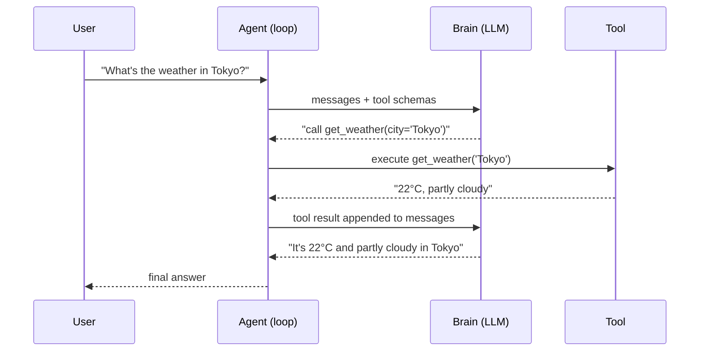
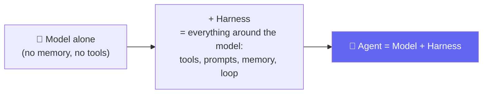
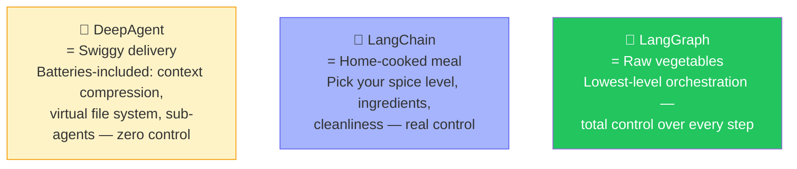
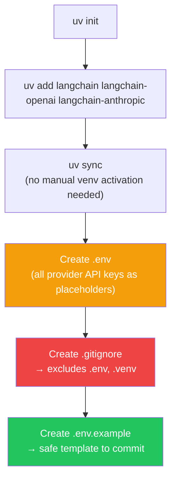
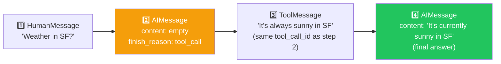
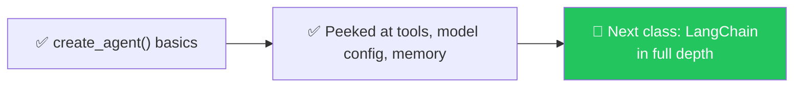

# 🔗 LangChain Begins 
**Author:** Pranay
**Course:** Agentic AI Specialization  
**Date:** 12 July 2026

---

## 📋 Table of Contents
1. [Quick Recap](#-quick-recap)
2. [Finishing the Pure-Python Agent — Tools Calling Themselves](#-finishing-the-pure-python-agent--tools-calling-themselves)
3. [Why LangChain? — The Swiggy / Home-Cooked / Vegetables Analogy](#-why-langchain--the-swiggy--home-cooked--vegetables-analogy)
4. [Setting Up a Real LangChain Project](#-setting-up-a-real-langchain-project)
5. [create_agent() — LangChain's One-Liner](#-create_agent--langchains-one-liner)
6. [First Look at Documentation-Driven Building](#-first-look-at-documentation-driven-building)
7. [Where This Leaves You](#-where-this-leaves-you)
8. [Live Q&A Highlights](#-live-qa-highlights)
9. [Action Items](#-action-items)
10. [Core Concepts — The Building Blocks](#-core-concepts--the-building-blocks)
    - [Model, Chatbot, Agent](#1-model-chatbot-agent)
    - [Technical Implementation](#2-technical-implementation)
    - [Tools & Decisions](#3-tools--decisions)
    - [Agent Architecture](#4-agent-architecture)
11. [Key Takeaways](#-key-takeaways)

---

## 🔁 Quick Recap

- ✅ Model → Chatbot → Agent hierarchy, fully internalized
- ✅ Two ways to access AI: **paid** (OpenAI, Anthropic) vs. **free/cheap** (Groq, OpenRouter) — both need an API key and credits/usage limits
- 🎯 Yesterday's agent only let *you* call tools manually. Today's upgrade: **the agent calls tools itself**, in a loop, using the schema you gave it

---

## 🛠️ Finishing the Pure-Python Agent — Tools Calling Themselves

**Analogy:** Think of this like a **personal assistant who can finally use the phone on their own**. Before, you had to tell them exactly when to make calls. Now, they decide when to call, what number to dial, and what to say, all by themselves — you just wait for the final answer.



> 🧠 **Sanity check posed:** *"If ChatGPT told you 'go search Google yourself and paste the results back to me' — would that be useful? No. You'd never use ChatGPT again. The whole point of an agent is that IT calls the tool, not you."*

- The full loop was wrapped in a `run_agent(messages, max_turns=4)` function — `max_turns` caps how many times the loop can call the brain again, preventing runaway costs/infinite loops
- 🔬 **Live proof of "no tool = no hallucinated call":** asked *"What is 1 USD in INR?"* with **no currency tool defined** → the model correctly gave a plain-text answer instead of inventing a tool call

---

## 🤔 Why LangChain? — The Swiggy / Home-Cooked / Vegetables Analogy

**Analogy:** Think of building AI agents like **cooking a meal**:
- **DeepAgent** = **Swiggy/Zomato delivery** — ready-to-eat, everything included, zero control over ingredients or hygiene
- **LangChain** = **home-cooked meal** — you pick the ingredients, the spice level, the cleanliness — real control
- **LangGraph** = **buying raw vegetables at the market** — maximum control, maximum effort

> *"We built agents in raw Python. We saw it works — but it doesn't scale long-term. That's exactly the gap a framework like LangChain fills."*



> **LangChain's own definition:** *"Agent = model + harness. LangChain provides `create_agent`, a minimal, highly configurable harness — everything around the model loop: the prompts, the tools, and any middleware that shapes behavior."*

### 🍽️ Three Levels of Control



- **DeepAgent** → grab-and-go: automatic context compression, virtual file system, sub-agent spawning. Zero control over internals.
- **LangChain** → "highly customizable harness, easily tailored to your use case and data." This is where the course starts.
- **LangGraph** → "low-level orchestration framework for advanced needs." Full control, steepest learning curve.
- **LangSmith** → separate tool for **monitoring/observability**, not agent-building itself

> 💬 *"Since you're going to build real software, not toy demos — you need the level of control LangChain gives you."*

---

## 🏗️ Setting Up a Real LangChain Project

**Analogy:** Think of setting up a project like **preparing a kitchen before cooking**. You need the right ingredients (dependencies), the right tools (environment), and safety measures (`.gitignore`). You wouldn't start cooking without preparing your kitchen first.



- Installing just 3 packages (`langchain`, `langchain-openai`, `langchain-anthropic`) pulled in **~45 dependencies** — normal, since each provider integration has its own transitive requirements
- 🔐 **Security habit reinforced:** accidentally pushed a real API key earlier in the session — a real-time cautionary example for why `.gitignore` + `.env.example` matters
- `pyproject.toml` already captures everything `requirements.txt` would — the better modern approach

---

## ⚡ `create_agent()` — LangChain's One-Liner

**Analogy:** Think of `create_agent()` like a **recipe card** for making your agent. Instead of writing down every step, temperature, and timing, you just follow the card — it has everything built in, but you still control the ingredients you put in.

```python
from langchain.agents import create_agent

agent = create_agent(
    model="openai:gpt-4o-mini",     # or anthropic, groq, gemini, ollama...
    tools=[get_weather],
    system_prompt="You are a helpful weather assistant."
)

result = agent.invoke({"messages": [{"role": "user", "content": "Weather in San Francisco?"}]})
```

> *"This is quite literally the same weather agent we spent hours building by hand — just in a few lines. `agent.invoke()` runs the entire loop we wrote manually."*

- Model provider is swappable by just changing the string prefix — OpenAI, Anthropic, Gemini, Groq, Ollama, Azure, Bedrock, Hugging Face, Fireworks
- Tools can be passed as **plain Python functions** — no need to hand-write a JSON schema

### 🔬 Peeling Back the Convenience — What's Actually Happening

Printing the raw `result["messages"]` after an `agent.invoke()` call revealed exactly the same anatomy built by hand:



- Each message carries `prompt_tokens` / `completion_tokens` / `total_tokens` — same token accounting concept from earlier
- 🔍 Confirmed live: this particular call ran the **agentic loop twice** — first an AI message triggering a tool call, then a second AI message using the tool's result
- ⚠️ **Trade-off named explicitly:** *"With this convenience, you lose some visibility and fine control"*
- 🐢 **Why LangChain calls can feel slower:** extra wrapping — generating IDs, structuring messages, internal bookkeeping

---

## 🧩 First Look at Documentation-Driven Building

### 🛠️ Tools via `@tool` Decorator

**Analogy:** Think of the `@tool` decorator like **putting a label on a box**. The box already contains a tool (your function). The label tells the AI what's inside and when to use it — without opening the box to see the actual function code.

```python
from langchain.tools import tool

@tool
def fetch_text_from_url(url: str) -> str:
    """Fetch and return the text content of a web page."""
    # ...implementation...
    return text
```

- The decorator takes your plain function and wraps it into everything an agent needs to call it — no manual schema-writing required

### 💾 Memory — Local Run vs. Persistent

- 🔬 **Live demo:** sent `"Hi, I am Mayank"` then `"Who am I?"` in **two separate script runs** → agent had no idea, because that "memory" only exists while the Python process is actively running
- Real persistence needs an explicit store: a database, a file, or a dedicated memory/checkpoint mechanism
- ⚠️ **On caching tool results — context matters, not a blanket rule:**
  - Stock prices → **never cache** (change every second)
  - Weather → cache for maybe a day
  - Currency conversion → cache for maybe 10 minutes

---

## 🗺️ Where This Leaves You



> *"This was the first framework — I want to go deep, because everything after this will build on it."*

---

## 💬 Live Q&A Highlights

| Question | Answer |
|---|---|
| **Do I need an API key just to use LangChain itself?** | LangChain is just the harness — you still always need your own AI provider API key |
| **Can `create_agent` use Groq, Gemini, OpenRouter, Ollama?** | Yes — any supported provider works, just swap the model string/config |
| **Is the default loop count fixed across all frameworks?** | No — it varies; some frameworks might cap it at 100 iterations |
| **Does LangChain require writing a tool schema like the raw-Python version did?** | No — pass a plain function; LangChain infers the schema using the docstring as the description |
| **Should tool results always be cached for performance?** | No — it depends entirely on how fast the underlying data changes |
| **Why does a LangChain agent feel slower than the raw Python version?** | Extra internal overhead — ID generation, message structuring, bookkeeping |

---

## ✅ Action Items

- [ ] **Re-run Raw Python:** Re-run all files from the pure-Python agent day once more — LangChain will make far more sense once that foundation is automatic
- [ ] **Project Setup:** Set up a fresh `uv` project with `langchain`, `langchain-openai`, `langchain-anthropic` installed
- [ ] **Security Practice:** Practice the `.env` + `.gitignore` + `.env.example` pattern — never let a real key hit GitHub
- [ ] **Build an Agent:** Build the weather agent using `create_agent()` yourself, then print `result["messages"]` and manually map each message back to the anatomy learned earlier
- [ ] **Tool Practice:** Try wrapping one of your own Python functions with `@tool` and giving it a clear docstring
- [ ] **Preparation:** Come back ready for **LangChain in full depth** next class

---

## 🧩 Core Concepts — The Building Blocks

### 1. Model, Chatbot, Agent

#### AI Model: A Brilliant Guesser with No Memory and No Hands

**Analogy:** A brilliant person in a windowless room with extraordinary reading knowledge. They answer perfectly about what they've read, but can only guess about what's happening outside right now.

An AI model predicts the next best words to say, given everything said so far. There is no separate understanding mechanism — the feeling of being understood comes entirely from being extremely good at this one narrow job.

- **Ask it something it has memorized**: Answers beautifully
- **Ask it to check current state** (weather, exchange rates): Can only guess, confidently

#### Chatbot: The Same Guesser, Now Handed a Transcript

**Analogy:** Same person, same windowless room — except now someone hands them the entire written conversation before each answer. Better memory, same guesswork.

A chatbot is the same model with one addition: a written record of the conversation re-shown in full on every turn. It isn't truly remembering — just reading the entire transcript fresh each time.

- Stops forgetting what you said messages ago
- Still cannot check anything real in the world

#### Agent: The Same Guesser, Now Handed a Phone

**Analogy:** Now someone hands the person a real phone. They don't guess about weather — they call someone who knows and relay the real answer back.

An agent is that same model, handed something genuinely new: the ability to call a real tool, get a real answer, and use it. The critical part is that **the model decides, on its own, when a question needs one**.

**The word "decides" is what separates an agent from everything before it.**

---

### 2. Technical Implementation

#### Calling a Real Model

**Analogy:** The phone gets plugged into a working line for the first time. Before this, it was just a prop. Now dialing actually connects to someone.

Underneath every chat interface sits one plain function call: send text in, servers do the prediction, text comes back. Everything elaborate — memory, tools, judgment — gets built as a layer wrapped around this basic call.

#### Paid vs. Free Providers

**Analogy:** Different phone companies, same phone call. Premium or free — you dial the same handset, ask the same question, only the billing company differs.

Several companies offer model access — some free, some paid — and the shape of the call is mostly identical. Swapping providers is closer to changing a phone number than rewriting the call.

#### Failing Loudly

**Analogy:** "This isn't connected" is better than making up a fake conversation. One is an honest dead end, the other is a lie that costs you later.

When there's no working provider, **fail immediately and clearly** with the exact problem. A confidently wrong answer is far more dangerous than an obvious failure.

#### Structured Output

**Analogy:** Hand them a form to fill out instead of asking for a paragraph. Forms are something the next step can actually use.

Models naturally reply in sentences. Structured output asks the model to reply in a fixed JSON shape with exact field names, so code can read it reliably.

#### Validation

**Analogy:** A bouncer holding the form spec, checking every single form. Empty boxes or wrong types get turned away immediately.

Asking for a specific shape doesn't guarantee it arrives that way. Validation is a strict check applied instantly.

---

### 3. Tools & Decisions

#### What Is a Tool

**Analogy:** One specific number in the phone — a direct line to a weather service. Nothing complicated, just one single-purpose contact.

A tool is an ordinary function — check weather, do arithmetic, look up exchange rates. It has no AI awareness; it just takes input and returns a result.

#### Manual Tool Calling

**Analogy:** The weather hotline is saved. But we still pick up the receiver, dial it ourselves, and relay the answer.

It's entirely possible to give the model access to a tool while you decide to call it. This works, but **the model still isn't deciding anything. We are.**

#### The Tool Schema

**Analogy:** A small card taped next to the phone listing every number they can call and when each is useful.

A tool schema is a plain-language description — name, purpose, required information — in a format the model can read. **The model never sees actual function code, only this description.**

#### The Model Chooses

**Analogy:** The person reads the card themselves and tells you which number to dial and why — without your suggestion.

Hand the model a question and the tool card together in the same call, and something changes: instead of plain text, it responds with exactly which tool it wants and what arguments.

**This is the precise moment a system stops being "a chatbot with a function attached" and becomes an agent.**

---

### 4. Agent Architecture

#### The Agent Loop

**Analogy:** The person might make multiple calls before answering — check weather, work out a conversion, then respond. Each time they hang up, they decide if one more call is needed.

Real questions often need several decisions in a row. The agent loop is exactly that repeating cycle: reason → act → observe → repeat.

This loop separates a genuine agent from fixed, hand-coded sequences. A loop decides steps fresh every time based on the actual question.

#### Memory

**Analogy:** One notepad on the desk. Every question, phone call, answer — written on the same notepad in order. The whole notepad gets glanced at again before every decision.

Memory is nothing exotic — just a running list: every message, every tool result, appended in order, and the entire list re-sent on every call.

#### The Complete Agent

**Analogy:** The room now has everything: a working phone, a card listing useful numbers, a growing notepad, and someone genuinely capable of deciding when to reach for any of it.

Every part was built from plain code, one concept at a time. **None of it required a specialized framework.**

#### Why No Framework First

**Analogy:** You could hire a company to furnish the room completely. Nothing wrong with that, later. But furnish it yourself once first — so when something eventually breaks, you recognize what failed.

Frameworks that build agents are genuinely useful — they save repetition once the underlying idea is understood. The risk is building something that works while understanding almost none of why.

---

## 📝 Key Takeaways

1. **Agent = Model + Harness** — the harness is everything around the model: tools, prompts, memory, loop
2. **The agent calls tools itself** — not you. That's the defining feature of an agent.
3. **Three levels of control** — DeepAgent (least control), LangChain (moderate), LangGraph (maximum)
4. **LangChain is free** — you only pay your model provider
5. **Security matters** — use `.env` and `.gitignore` to protect API keys
6. **`create_agent()` is a one-liner** — but it does the same work you built by hand
7. **LangChain infers schemas** — no need to hand-write JSON schemas
8. **Caching depends on context** — stock prices ≠ weather ≠ currency rates
9. **Build by hand once** — so you understand what frameworks are doing for you
10. **Master the fundamentals** — frameworks become trivial afterward

---

## 📚 Additional Resources

- [LangChain Documentation](https://docs.langchain.com/)
- [LangChain Quickstart](https://docs.langchain.com/oss/python/langchain/quickstart)
- [LangGraph Documentation](https://langchain-ai.github.io/langgraph/)
- [LangSmith Documentation](https://docs.smith.langchain.com/)

---

