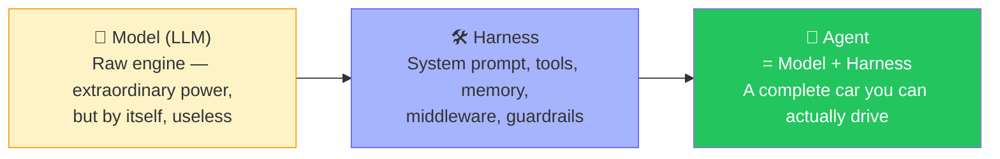
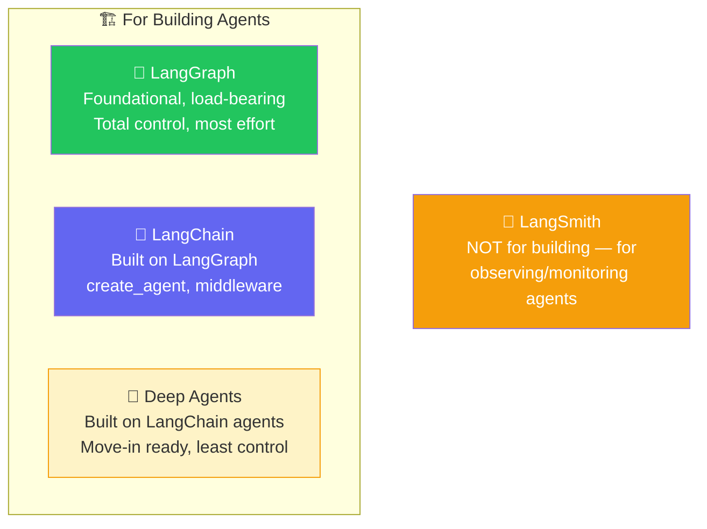
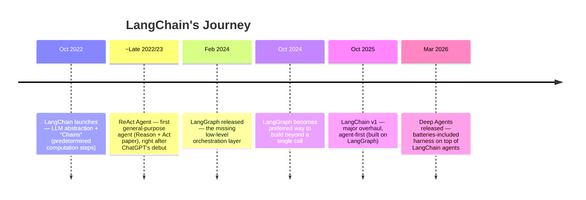
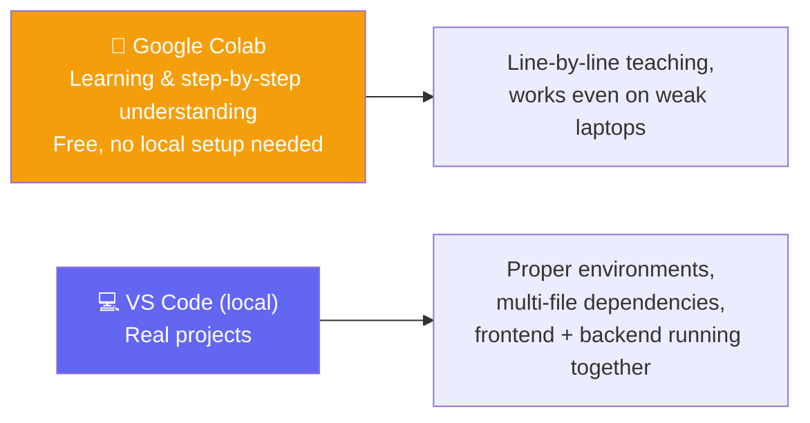
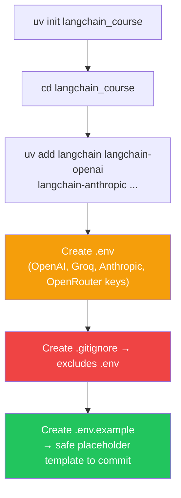
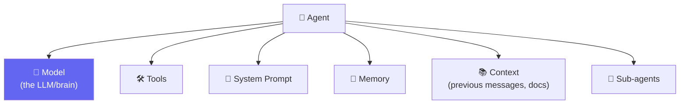
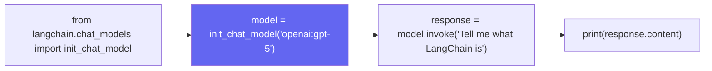
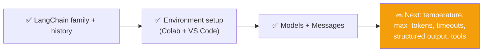

# 🚗 The LangChain Family, Harness Engineering & First Models

**Author:** Pranay  
**Course:** Agentic AI Specialization  
**Date:** 19 July 2026

---

## 📋 Table of Contents
1. [The Goal for This Multi-Class Arc](#-the-goal-for-this-multi-class-arc)
2. [The Big Analogy — Model = Engine, Agent = Car, LangChain = Harness](#-the-big-analogy--model--engine-agent--car-langchain--harness)
3. [The LangChain Family — Four Offerings](#-the-langchain-family--four-offerings)
4. [The LangChain Timeline — How Fast This Field Moves](#-the-langchain-timeline--how-fast-this-field-moves)
5. [How This Course Will Run Code Going Forward](#-how-this-course-will-run-code-going-forward)
6. [Setting Up a Real LangChain Project](#-setting-up-a-real-langchain-project)
7. [Agent = Model + Harness — With Named Components](#-agent--model--harness--with-named-components)
8. [Diving Into "Model" — The First Deep-Dive Component](#-diving-into-model--the-first-deep-dive-component)
9. [Open vs. Closed Source — Quick Clarification](#-open-vs-closed-source--quick-clarification)
10. [Where This Class Left Off](#-where-this-class-left-off)
11. [Live Q&A Highlights](#-live-qa-highlights)
12. [Action Items](#-action-items)
13. [Key Takeaways](#-key-takeaways)

---

## 🎯 The Goal for This Multi-Class Arc

**Analogy:** Think of learning LangChain like learning a **foreign language**. If you learn one language deeply — grammar, vocabulary, sentence structure — every other language becomes easier to learn. The same applies to frameworks: master LangChain deeply, and LangGraph, CrewAI, and ADK all become fast to learn.

> *"Rather than rushing or jumping around, we're going to build a very, very strong base — one we can stand on for every framework after this."*

LangChain will be taught **in real depth over 3-4 classes**, because it's the foundation every other framework in this course (LangGraph, ADK, AutoGen, Amazon's Agent SDK) will be compared against.

📚 **Study format introduced:** the **Pomodoro Technique** — 15-20 min focused teaching blocks, then a short break, repeated throughout class.

---

## 🚙 The Big Analogy — Model = Engine, Agent = Car, LangChain = Harness

**Analogy:** Think of a model like a **Formula 1 engine**. It's incredibly powerful — capable of extraordinary speed and precision. But an engine by itself can't do anything. You need to connect it to a chassis, steering wheel, brakes, and fuel system (the harness) to create a car (the agent). Without the harness, the engine just sits there, powerful but useless.



> *"The model is the raw engine — the brain. It has extraordinary power, can reason about almost anything. But without a harness, it has no idea what tools exist, it's completely stuck, it can't go anywhere by itself. Even Claude Code and ChatGPT are, at their core, this same brain wrapped in connectors, skills, memory, and web search — harnessed."*

- 🎯 **"Harness Engineering"** — a term getting popular right now — is exactly this: how well you wrap a raw model with the right system prompt, tools, middleware, guardrails, and checkpoints so it becomes genuinely useful
- LangChain's own philosophy: *"LLMs are even better when combined with external sources of data — tools and other data."*

---

## 🏠 The LangChain Family — Four Offerings

**Analogy:** Think of the LangChain family like **different levels of a restaurant kitchen**:
- **LangGraph** is like **buying raw ingredients from the market** — maximum control, maximum effort
- **LangChain** is like **having a fully stocked kitchen** — you control the recipes, ingredients, and cooking process
- **Deep Agents** is like **ordering from a meal delivery service** — everything is prepared, just heat and serve
- **LangSmith** is like **security cameras in the kitchen** — you watch what happened, but you don't cook with it



> ⚠️ **Common mix-up cleared:** **LangFuse** is *not* part of the LangChain family — it just happens to share "Lang" in the name. It's an independent, open-source observability platform.

### 🍽️ Why Start With LangChain (Not Deep Agents)?

> *"Starting directly with Deep Agents would mean starting a job as a chef but only knowing how to order from Swiggy or Zomato. You'd get food, but zero control. LangChain is like a kitchen — you control the spice level, the ingredients, the cleanliness. LangGraph goes even lower — you're controlling which vegetables to even buy."*

- **Deep Agents** = "batteries included" — automatic context compression, virtual file system, sub-agent spawning, but far less configurability
- **LangChain** = the course's starting point: real customization without needing to hand-build every primitive
- **LangGraph** = true low-level orchestration for when deterministic + agentic workflows must be tightly controlled (streaming, durable execution, short/long-term memory, human-in-the-loop)
- 📌 Intended mastery order: **LangChain → LangGraph → Deep Agents** (Deep Agents becomes trivial once the other two are solid)

### 🔭 LangSmith — The Flight's Black Box

**Analogy:** Think of LangSmith like a **flight's black box**. When a flight goes wrong, investigators don't guess what happened — they pull the black box data. Similarly, when an agent behaves unexpectedly, LangSmith shows you exactly what happened: when the model was called, when a tool was called, what happened in the middleware, and how it all ended.

> *"We can't just read agent code to know what it did — we need its trace. Like a flight's black box: when the model was called, when a tool was called, what happened in the middleware, and how it all ended."*

---

## 📜 The LangChain Timeline — How Fast This Field Moves

**Analogy:** Think of LangChain's evolution like **smartphone generations**. Each generation brings major changes, and if you're still using an iPhone 3 (LangChain Classic), it might still "work," but nobody's fixing bugs in it anymore. You need to keep up with the latest version to get new features and security updates.



> 💬 *"Old 'Chains' were like a fixed workflow: prompt → node → node → node. Then ReAct gave us agents that could actually reason and act — which is still the shape of most real applications today."*

- **Low-level vs. high-level, explained through real life:** *"The lowest level is where you have the most control — like everything on your desk, you can control directly. A low-level language provides little to no abstraction; it maps closer to the hardware, giving you precise manual control."*
- ⚠️ **Version warning:** most YouTube tutorials and blog posts still teach **LangChain Classic** (pre-v1). This course teaches **v1.0+ only** — old code still runs, but it's now legacy and unmaintained.

---

## 🖥️ How This Course Will Run Code Going Forward

**Analogy:** Think of Colab like a **test track** where you can safely learn to drive without worrying about traffic or mechanics. VS Code is like the **real road** where you drive your actual car to work every day. Both are important, but they serve different purposes.



> *"Colab notebooks are the best way to learn line by line, regardless of your laptop's specs. But real projects — with multiple dependent files and a frontend — happen in VS Code."*

All notebooks are also pushed to GitHub for reference; **don't code along live** — watch, then practice using the recording.

---

## 🏗️ Setting Up a Real LangChain Project (VS Code)

**Analogy:** Think of setting up a project like **preparing a kitchen** before cooking. You need to organize your ingredients (dependencies), set up your tools (environment), and create safety measures (.gitignore, .env). You wouldn't start cooking without preparing your kitchen first.



- `pyproject.toml` tracks everything needed — a `requirements.txt` is optional/legacy-style, not required
- 🔬 **Live debug demoed:** a notebook initially failed to read `.env` because the wrong Python interpreter/kernel was selected in VS Code — fixed by explicitly selecting the project's own `.venv` interpreter
- Loading keys: `load_dotenv()` then `os.environ.get("OPENAI_API_KEY")` — confirmed working by printing just the first 5 characters (never the full key) as a safe sanity check
- 🔐 **In Colab specifically:** use the built-in **Secrets** manager (🔑 icon) instead of hardcoding a key in a cell
- ⚙️ **Alternative key-setting method shown:** `import os; os.environ["OPENAI_API_KEY"] = "..."` — works, but `.env` + `load_dotenv()` is the safer, reusable pattern

### 🔬 Sanity Check — Confirming the Whole Setup Works

```python
from langchain.agents import create_agent

def get_weather(city: str) -> str:
    """Get the weather for a given city."""
    return f"It's always sunny in {city}"

agent = create_agent(
    model="openai:gpt-5.5",
    tools=[get_weather],
    system_prompt="You are a helpful assistant."
)
agent.invoke({"messages": [{"role": "user", "content": "Weather in SF?"}]})
```

> *"If this runs on both Colab and VS Code, your entire environment is correctly wired — same code works whether you're on a personal laptop or an office machine."*

---

## 🧩 Agent = Model + Harness — Now With Named Components

**Analogy:** Think of an agent like a **professional sports team**. The model is the star player (great skills). But the star player needs a coach (system prompt), teammates (tools), a playbook (context), and support staff (memory, sub-agents). The harness is everything around the star player that makes the team successful.



> *"Tomorrow, don't come to me saying 'Pranay, I used Haiku but expected the smartest agent alive.' If you wanted that, you should've used Fable/Opus. The capability of your agent will always depend on the brain you chose."*

- LangChain's `create_agent` officially exposes: **model, tools, system prompt, structured output, invocation, streaming output**, and harness configuration
- 🔑 **Key resolution behavior confirmed live:** setting `OPENAI_API_KEY` in the environment lets LangChain auto-detect and use it — LangChain expects **exact standard variable names** per provider

---

## 🧠 Diving Into "Model" — The First Deep-Dive Component

**Analogy:** Think of `init_chat_model` like a **universal remote control**. Instead of having different remotes for your TV, sound system, and streaming device, you have one remote that controls everything. Similarly, `init_chat_model` gives you one interface that works with OpenAI, Claude, Groq, and OpenRouter.



- `init_chat_model` is LangChain's universal entry point — swap the provider string and the rest of the code stays identical
- This is the core value proposition: *"Without LangChain, you'd write completely different code to connect to OpenAI vs. Claude vs. Groq vs. OpenRouter — LangChain harnesses all of that into one consistent interface."*
- Every model supports a different mix of capabilities — **tool calling, structured output, multimodality (text+image), reasoning**

### 💬 Message Types — System, Human, and Assistant

**Analogy:** Think of messages like **roles in a conversation**. The system message is like the **director's notes** for a play — it sets the tone and rules. The human message is the **audience member asking a question**. The assistant message is the **actor responding** in character. Each role serves a different purpose.

```python
from langchain_core.messages import SystemMessage, HumanMessage

messages = [
    SystemMessage(content="You are a pirate. Answer everything in pirate language."),
    HumanMessage(content="What is the capital of France?")
]

response = model.invoke(messages)
print(response.content)
```
> 🔬 **Live proof:** running this produced a genuinely pirate-flavored answer — a fun, concrete demonstration that the system message actually steers behavior.

---

## 📖 Open vs. Closed Source — Quick Clarification

**Analogy:** Think of open-source models like a **public library** — anyone can read the books, borrow them, and even contribute new books. Closed-source models are like a **private collection** — you can visit and read, but you can't take anything home or see how it's organized.

| | 🔓 Open Source | 🔒 Closed Source |
|---|---|---|
| **Access to weights/parameters** | ✅ Yes — can self-host, fine-tune | ❌ No — never provided |
| **Hosting** | Can run on your own infrastructure | Must use via the provider's API only |
| **Cost model** | Often free or self-hosted cost only | Pay the company per use |
| **Fine-tuning** | Possible | Not possible |

---

## ⏸️ Where This Class Left Off

> *"I planned to cover Models and Messages today — we've done that. We'll continue with temperature, max tokens, and API timeout next class."*



---

## 💬 Live Q&A Highlights

| Question | Answer |
|---|---|
| **Is LangChain foundational, and is LangGraph built on top of it?** | No — it's the other way around: **LangGraph is the foundation**; LangChain is built on top of LangGraph |
| **Does LangChain cost anything to use?** | No — LangChain itself is free; you only pay your model provider (OpenAI, Anthropic, etc.) |
| **Is LangChain still widely used in production?** | Yes |
| **Does LangChain offer official support if something breaks in our implementation?** | No — open a GitHub issue if it's a genuine bug, but there's no dedicated support unless your company has a contract |
| **Can we use multiple models and compare their outputs?** | Yes, absolutely — that's a common workflow |
| **Which is "better," Anthropic or OpenAI?** | Doesn't matter in the abstract — depends entirely on your use case, budget, and needs |
| **Should a real project use paid or free models?** | Depends on the project's requirements and budget — no universal answer |
| **Does ChatModel automatically sort/manage chat history?** | No — it does nothing extra for you by default; history management is still on you |

---

## ✅ Action Items

- [ ] **Project Setup:** Set up a fresh `uv`-based LangChain project locally (`.env`, `.gitignore`, `.env.example`)
- [ ] **Sanity Check:** Run the `create_agent` sanity check on both Colab and VS Code — confirm both work identically
- [ ] **Model Practice:** Practice `init_chat_model` with at least two different providers (e.g., OpenAI + one free option like OpenRouter/Groq)
- [ ] **Message Practice:** Try `SystemMessage` + `HumanMessage` with a fun persona (like the pirate example) to see the system prompt's effect firsthand
- [ ] **Capability Research:** Look up the capability sheet (tool calling, structured output, multimodality) for the model you plan to use most
- [ ] **Concept Review:** Revise open vs. closed source distinctions
- [ ] **Preparation:** Come back ready for: **temperature, max tokens, API timeouts, structured output, and tools**

---

## 📝 Key Takeaways

1. **Model = Engine, Agent = Car, LangChain = Harness** — the harness turns raw power into usable capability
2. **LangChain is built on LangGraph** — not the other way around
3. **Four offerings in the family** — LangGraph (foundation), LangChain (main interface), Deep Agents (batteries-included), LangSmith (observability)
4. **LangChain v1+ is current** — most tutorials still teach "Classic" (pre-v1)
5. **Google Colab for learning, VS Code for projects** — both have their place
6. **`.env` + `.gitignore` is the safe pattern** — never commit API keys
7. **`init_chat_model` is a universal interface** — swap providers without changing code
8. **Message types matter** — System, Human, and Assistant messages serve different roles
9. **Open vs. closed source** — each has trade-offs in access, cost, and fine-tuning

---

## 📚 Additional Resources

- [LangChain Documentation](https://docs.langchain.com/)
- [LangGraph Documentation](https://langchain-ai.github.io/langgraph/)
- [LangSmith Documentation](https://docs.smith.langchain.com/)
- [Deep Agents Documentation](https://docs.langchain.com/oss/python/deepagents/overview)

---
