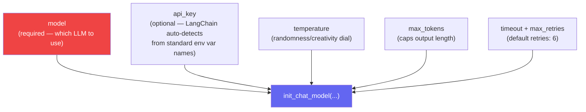
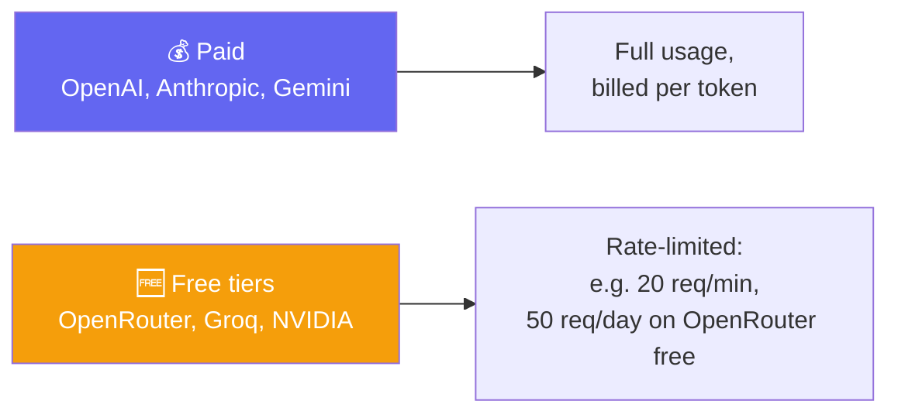
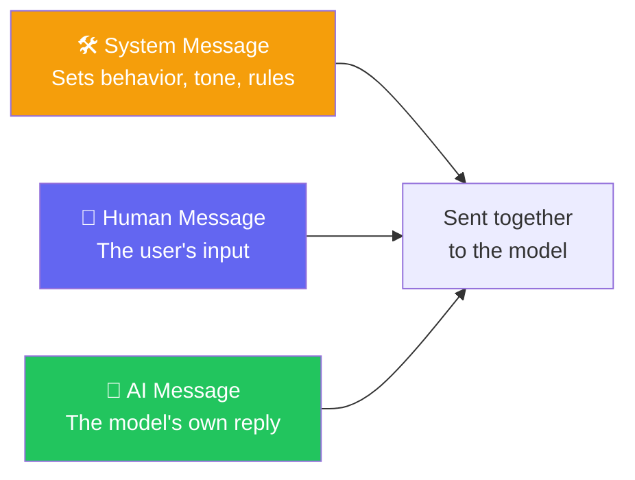
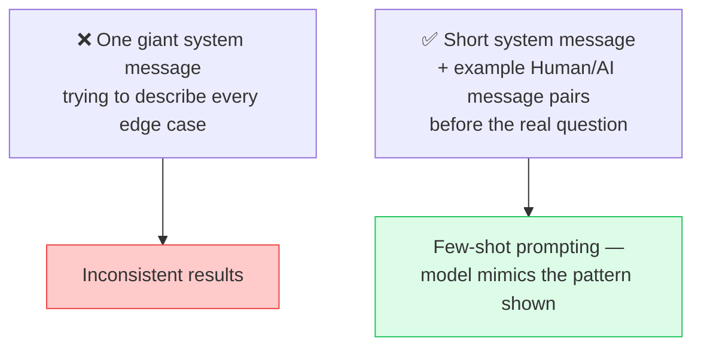
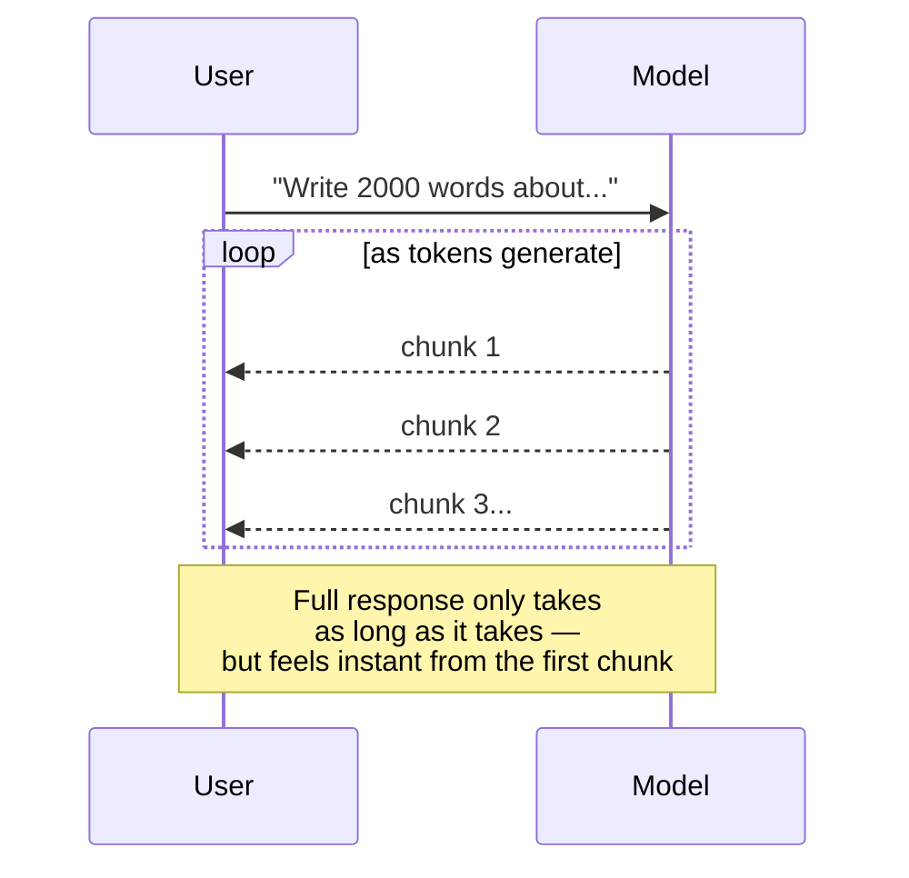
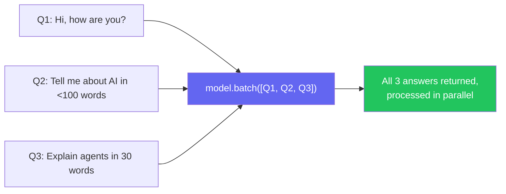
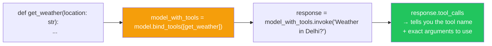
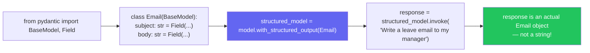

# 🧠 Inside the Model — Parameters, Streaming, Tools & Structured Output
**Author:** Pranay
**Course:** Agentic AI Specialization  
**Date:** 19 July 2026

---

## 📋 Table of Contents
1. [Framing — Going Deep vs. Surface-Level Tutorials](#-framing--going-deep-vs-surface-level-tutorials)
2. [Model Parameters — What Actually Goes Into init_chat_model](#-model-parameters--what-actually-goes-into-init_chat_model)
3. [Free vs. Paid Models — Real Limits Shown](#-free-vs-paid-models--real-limits-shown)
4. [Message Types Recap + A Real Debugging Story](#-message-types-recap--a-real-debugging-story)
5. [Anatomy of an AI Message](#-anatomy-of-an-ai-message)
6. [Streaming — Why "Feels Fast" Matters More Than "Is Fast"](#-streaming--why-feels-fast-matters-more-than-is-fast)
7. [Batching — Solving the "Too Many Questions" Problem](#-batching--solving-the-too-many-questions-problem)
8. [Tool Binding — How a Model Learns What It Can Call](#-tool-binding--how-a-model-learns-what-it-can-call)
9. [Structured Output — Pydantic Meets the Model](#-structured-output--pydantic-meets-the-model)
10. [The Big-Picture Realization](#-the-big-picture-realization)
11. [Live Q&A Highlights](#-live-qa-highlights)
12. [Action Items](#-action-items)
13. [Key Takeaways](#-key-takeaways)

---

## 🧭 Framing — Going Deep vs. Surface-Level Tutorials

**Analogy:** Think of learning LangChain like learning to drive. A 5-minute tutorial teaches you to press the gas pedal and turn the wheel — you can move the car. But real driving means understanding what all the dashboard indicators mean, how the transmission works, when to use different gears, and what to do when something goes wrong. This course is about becoming a real driver, not just someone who can make the car move.

Pranay drew a clear line between two types of learners: those who stop at the quickstart — happy that `create_agent()` works — versus those who actually understand every feature LangChain exposes around a model. He was explicit that this course is aiming for the second kind, because superficial familiarity doesn't hold up once real, complex use cases show up on the job.

---

## ⚙️ Model Parameters — What Actually Goes Into `init_chat_model`

**Analogy:** Think of model parameters like the **settings on a camera**. Temperature is like the ISO — higher values make the image grainier (more creative/random). Max tokens is like the memory card size — it caps how much you can capture. Timeout is like the shutter delay — how long you'll wait before giving up.



- **`model`** is the only truly required field
- **`api_key`** isn't required as a parameter because LangChain assumes the standard environment variable is already set (`OPENAI_API_KEY`, `ANTHROPIC_API_KEY`, etc.)
- **`max_tokens`** directly controls output length — flagged as the fix for a very common OpenRouter error where a response exceeds the allowed limit
- **`temperature`** controls randomness/creativity — lower values (0-0.3) produce more focused, deterministic responses; higher values (0.7-1.0) produce more creative, varied responses
- **`timeout`** and **`max_retries`** (default: 6) manage how long and how persistently LangChain waits on a model response before giving up
- These get passed as **keyword arguments** — explicit `key=value` pairs sent alongside the model name

---

## 🌍 Free vs. Paid Models — Real Limits Shown

**Analogy:** Think of free models like a **public library** — you can borrow books, but there might be limits on how many you can take, and you might have to wait for popular titles. Paid models are like **buying your own books** — unlimited access, but you pay for each one.



- Live-demoed hitting OpenRouter's **free-tier rate limit** directly — confirmed the caps really do apply even for lightweight testing
- **Groq** hosts mostly **open-source models**, and Groq itself pays for and manages the hosting infrastructure — that's the trade being made in exchange for free/cheap access
- 💬 The "free lunch" reality check: free models generally trail Anthropic/OpenAI flagship quality — that gap is the cost of not paying

---

## 💬 Message Types Recap + A Real Debugging Story

**Analogy:** Think of messages like **parts of a conversation** at a restaurant. The system message is like the **waiter's training manual** — it sets how they should behave. The human message is what the **customer says**. The AI message is what the **waiter responds**. The tool message is like the **waiter checking with the kitchen** — it's an internal step the customer might not see.



- 🔬 **Live proof:** sending a single "hi" to Claude actually transmits **thousands of tokens** once the hidden system message is included
- ⚠️ **Important distinction:** in a finished product like Claude's own web app, the system message is **fixed by the provider** and cannot be changed. When building a custom agent, the developer controls and can freely edit that system message

### 📖 A Real Debugging Story — Why Message History Beats a Bloated System Prompt

> Pranay shared a real experience from earlier in his career, building a co-pilot-style chatbot application. He noticed the assistant wasn't performing well even with a solid system message. Rather than continuing to pile more instructions into that one system message, he restructured the conversation by inserting a few example exchanges as **separate prior messages** — alternating a sample user message with a sample AI reply — *before* the real user's question. The model's output improved noticeably once it had those example turns to anchor its behavior, rather than relying purely on a written instruction.



```python
from langchain_core.messages import SystemMessage, HumanMessage, AIMessage

messages = [
    SystemMessage(content="You are a helpful support assistant."),
    HumanMessage(content="Example question..."),
    AIMessage(content="Example ideal answer..."),
    HumanMessage(content="Actual user question here"),
]
response = model.invoke(messages)
```

> 💡 Messages can also be passed as plain **dictionaries** with a `role` key (`role: "system"`, `role: "user"`, `role: "assistant"`) instead of the dedicated message classes — both work identically.

---

## 🧬 Anatomy of an AI Message

**Analogy:** Think of an AI message like a **package delivery**. The package has the content (what's inside), but also has labels (ID), tracking information (metadata), and sometimes instructions (tool calls). You need to look at all parts of the package, not just what's inside.

When a model responds, the object returned carries far more than just the reply text:

- The **text content** — what the AI actually said
- A **content block** — structured content
- An **ID** — unique identifier for the message
- **Tool call** information — when the AI wants to use a tool
- **Metadata** — finish reasons, usage information

Understanding this full shape matters because later features (streaming, structured output, tool calling) all build on reading these fields correctly rather than just the final text.

---

## 📡 Streaming — Why "Feels Fast" Matters More Than "Is Fast"

**Analogy:** Think of streaming like **pouring water from a pitcher**. If you pour it all at once, you have to wait until the pitcher is empty to get any water. But if you pour a stream, you start getting water immediately — even though the total time is the same, it *feels* faster.

> **The demo that made it click:** asking ChatGPT to write a 2,000-word passage takes roughly 5–7 seconds to fully generate — but the text visibly appears piece by piece rather than all at once at the end. That progressive appearance *is* streaming, and it's the reason the wait doesn't feel as long as it actually is.



```python
for chunk in model.stream("Why do parrots have colorful feathers?"):
    print(chunk.text, end="", flush=True)
```

- Framed as directly relevant to real product work: if building something for a company like Amazon or Swiggy, user experience matters — no one would want to ship a UI that just sits frozen for 7 seconds
- No extra library installation needed — streaming is built into the model call itself; just swap `.invoke()` for `.stream()`
- Collecting streamed chunks into one final message typically requires accumulating them in a loop

---

## 📦 Batching — Solving the "Too Many Questions" Problem

**Analogy:** Think of batching like **ordering at a restaurant with a group**. Instead of each person going up to the counter one by one (ask, wait, ask, wait), the waiter takes everyone's order at once (batch) and brings everything back together. It's more efficient for everyone.

> **The scenario posed:** imagine being an AI developer at a company that receives a constant stream of questions to answer. Calling the AI one question at a time — ask, wait, ask, wait, ask, wait — is slow and needlessly expensive compared to sending several independent questions together.



```python
responses = model.batch([Q1, Q2, Q3])
for response in responses:
    print(response)
```

- Batching requests must be **independent** of each other — this is what allows them to run in parallel
- By default, `.batch()` waits for and returns **everything at once**
- For a progressive alternative, `batch_as_completed()` returns each answer as soon as it individually finishes
- Practical framing: a company's Q&A portal could **collect requests over a short window** (e.g., every 15 seconds) and batch them, cutting cost and improving throughput
- 📌 **Three ways to call a model:** `.invoke()` (single call), `.stream()` (progressive output), `.batch()` (parallel, independent requests)

---

## 🛠️ Tool Binding — How a Model Learns What It Can Call

**Analogy:** Think of tool binding like **giving a chef a menu**. The chef knows all the dishes on the menu (tools) and can describe how to make them (arguments), but the chef doesn't actually cook anything until someone in the kitchen (your code) executes the recipe. The model can tell you what to do, but it can't do it itself.

> **The core idea:** a raw model has no built-in awareness of any function in the codebase — it can't magically know a `get_weather()` function exists just because it's sitting in the same file. **Binding** is the explicit act of telling the model, *"here is the list of tools available to you, and here's what each one does."*



```python
def get_weather(location: str) -> str:
    """Get the current weather at a given location."""
    return f"It's sunny in {location}"

# Step 1: bind the tool(s) to the model — just makes the model aware they exist
model_with_tools = model.bind_tools([get_weather])

# Step 2: invoke as usual — the model decides whether a tool is needed
response = model_with_tools.invoke("What is the weather in Delhi?")

# Step 3: inspect what the model decided
print(response.tool_calls)
# → [{'name': 'get_weather', 'args': {'location': 'Delhi'}, 'id': '...'}]
```

- 🔑 **Crucial clarification:** calling `.invoke()` after binding tools does **not** execute the tool. It only asks the model to decide *whether* and *how* it would call a tool
- 🧩 **What happens on `.invoke()`:** the model reads the user's message alongside the schemas of every bound tool, and decides one of two things — reply directly in plain text, or respond with a **tool call** instruction
- When it chooses the latter, `response.content` comes back **empty**, and all the useful information lives in `response.tool_calls`
- 🔁 **Why the developer still has to do the calling:** binding only gets the model to *decide*. The actual execution requires reading `response.tool_calls`, calling the function, and feeding the result back — exactly the loop built by hand earlier in the course
- ⚠️ A **docstring is still important** — a tool defined without one risks the model guessing its purpose incorrectly

---

## 📐 Structured Output — Pydantic Meets the Model

**Analogy:** Think of structured output like a **standardized form** at a doctor's office. Everyone fills out the same form with the same fields — name, date of birth, symptoms. The receptionist can reliably read every form because they're all the same shape. Pydantic schemas create that same standardization for AI responses.

> **The connecting question:** given everything already learned about Pydantic's field and data validation — shouldn't a model be able to reply in that same structured, validated shape, instead of free text?



```python
from pydantic import BaseModel, Field

class Email(BaseModel):
    subject: str = Field(description="The email subject line")
    body: str = Field(description="The email body")

structured_model = model.with_structured_output(Email)
response = structured_model.invoke("Write a leave email to my manager")

print(type(response))  # <class '__main__.Email'>
```

> 🎯 **Why this matters downstream:** if an application's logic depends on getting an `Email` object back, it will never unexpectedly fail on a malformed string — the model itself is now constrained to reply in exactly that shape.

---

## 🧩 The Big-Picture Realization

**Analogy:** Think of using a model like using a **powerful tool**. Anyone can pick it up and press the button (5-minute tutorial). But a true craftsman understands every knob, dial, and setting — they know when to adjust temperature, when to use streaming, when to batch requests, and how to connect tools. The tool isn't magic; the skill comes from understanding what's under the hood.

By this point, everything ties together: everyone can technically "use a model" with a five-minute tutorial — but real engineering means understanding every knob LangChain exposes around that model:

- **Input types (messages)** — system, human, AI, tool
- **Parameters (temperature, max_tokens, timeout, max_retries)**
- **Tools — binding and execution**
- **Structured output — Pydantic schemas**

---

## 💬 Live Q&A Highlights

### During the Teaching Flow

| Question | Answer |
|---|---|
| **Does `create_agent` call a tool in a single `invoke`?** | Normally yes — by default it resolves within a single invoke call |
| **Can the system message be changed if a different LLM is used?** | Yes, the system message can be changed regardless of which model is behind it |
| **Is a system message the same as a "skill"?** | No — they are different concepts |
| **Any advantage to using message dictionaries over message classes?** | No functional advantage; class-based approach is preferred for clarity |
| **Does batching increase latency?** | Only if waiting for the entire batch to finish; using `batch_as_completed` avoids that |
| **Can streaming and batching be combined?** | Yes — `batch_as_completed` effectively streams results as each item finishes |

### Extended Doubt-Clearing Session (End of Class)

**🔧 Manually resolving a tool call — the full walkthrough**

A learner asked for a step-by-step demonstration of what happens between the model saying "call this tool" and the final answer coming back:

- When the AI decides a tool is needed, `response.content` comes back **empty**
- The actual instruction lives in `response.tool_calls`, which includes the tool's **name**, its **arguments**, and a unique **ID**
- The developer manually looks up and calls the real Python function using those extracted arguments
- The function's return value has to be wrapped and sent back as a **`ToolMessage`** with the same `tool_call_id`
- `ToolMessage` supports `content`, `tool_call_id`, `artifact` (for richer output), and `status` (success/failure)

**💰 Does batching actually save tokens?**

A learner pushed hard on whether batching 3 questions together avoids resending the system message 3 times:

- **No — tokens are not saved.** Every individual request inside a batch still carries its own full system message and context
- **What actually gets saved is cost and time**, coming from two places: (1) **provider-side batch APIs** (e.g., OpenAI's batch endpoint processes jobs at roughly 50% lower cost), and (2) **infrastructure savings** — fewer round trips, handshakes, and connections

**🌐 Confirming everything really is "just an API call" underneath**

Every AI call — regardless of framework — is fundamentally a standard API request/response. LangChain, OpenRouter, Claude, and raw `chat.completions` calls are all, underneath, the same kind of API interaction.

**🧭 Routing a query to the right agent among several specialized agents**

For a system with 4-5 specialized agents:

- Treat each agent like a **tool** — give the routing step only a short **name + description** for each agent
- The routing decision can be as simple as an `if` statement or as sophisticated as a small dedicated LLM call for classification
- If agent descriptions are too large, treat it as its own retrieval problem

**📝 Managing context across a multi-day, multi-session build**

To avoid re-sending an entire project's context every day:

- Maintain a running summary file (e.g., `memory.md`) updated by the AI itself after each session
- On the next session, only that summary file needs to be read back in
- ⚠️ Honest trade-off: summarizing to save tokens *can* lose detail if the project is complex enough

---

## ✅ Action Items

- [ ] **Practice Parameters:** Practice setting `temperature`, `max_tokens`, `timeout`, and `max_retries` explicitly on a model and observe the differences
- [ ] **Few-Shot Prompting:** Recreate the few-shot prompting pattern: system message + example Human/AI pairs + real question — compare output quality against a plain system-message-only version
- [ ] **Streaming:** Try `.stream()` on a long-form prompt and print chunks as they arrive
- [ ] **Batching:** Try `.batch()` with 3 independent questions, then try `batch_as_completed()` and compare the experience
- [ ] **Tool Binding:** Practice `bind_tools()` on a simple function, call `.invoke()`, and inspect `response.tool_calls` — remember, the tool itself is *not* actually executed yet
- [ ] **Structured Output:** Define a Pydantic model and use `with_structured_output()` to get a real typed object back instead of a string
- [ ] **Message Types:** Revise all message types (System, Human, AI) and the AI message anatomy

---

## 📝 Key Takeaways

1. **Model parameters control behavior** — temperature, max_tokens, timeout, max_retries
2. **Free models have real limits** — rate limits that affect even lightweight testing
3. **Messages have structure** — system, human, AI, and tool messages each serve different roles
4. **Few-shot prompting beats bloated system messages** — examples work better than instructions
5. **Streaming improves user experience** — progressive output makes waits feel shorter
6. **Batching improves efficiency** — parallel processing for independent requests
7. **Tool binding is not execution** — binding only tells the model what's available; your code still runs the tool
8. **Structured output = standardized forms** — Pydantic schemas guarantee reliable, parseable responses
9. **Everything is just an API call** — frameworks add convenience, not magic

---

## 📚 Additional Resources

- [LangChain Models Documentation](https://docs.langchain.com/oss/python/langchain/models)
- [LangChain Streaming](https://docs.langchain.com/oss/python/langchain/streaming)
- [LangChain Batching](https://docs.langchain.com/oss/python/langchain/batching)
- [LangChain Tools](https://docs.langchain.com/oss/python/langchain/tools)
- [LangChain Structured Output](https://docs.langchain.com/oss/python/langchain/structured-output)

---
